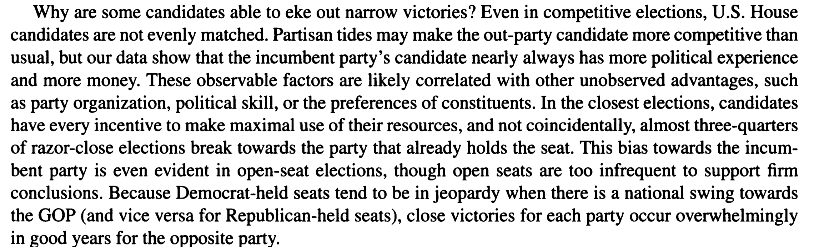
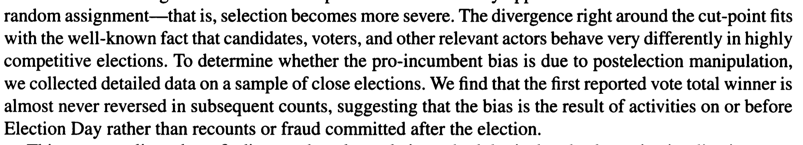
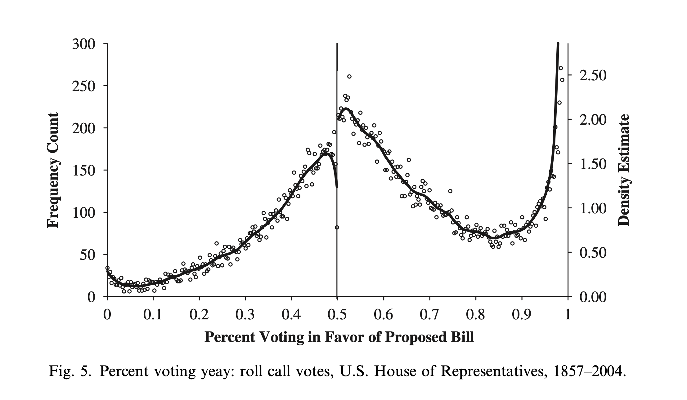

# Desenho de Regressão Descontínua

## Roteiro da aula

Na aula de hoje, iremos aprender como desenhos de regressão descontínua usam regras com pontos de corte para identificar efeitos causais locais.

A aula terá uma ênfase aplicada. Primeiro, vamos construir a intuição do desenho, distinguir *sharp RD* de *fuzzy RD* e conectar fuzzy RD à aula anterior de variáveis instrumentais. Depois, veremos como estimar RD em R com `rdrobust`, como interpretar bandwidths automáticos e como checar a plausibilidade do desenho. Ao final, discutiremos casos difíceis: eleições apertadas, variáveis de ordenação discretas, múltiplos cutoffs, RD espacial e diagnósticos de manipulação.

## Características-chave da RDD

A Regressão Descontínua (RDD) é caracterizada por uma variável de ordenação $X_i$ que determina, ou altera fortemente, a chance de receber tratamento em um ponto de corte conhecido $c$. Por convenção, $X_i$ é chamada de *running variable*, *assignment variable* ou *forcing variable*. Como no restante do livro, o tratamento é denotado por $D_i$, com $D_i=1$ para tratados e $D_i=0$ para controles.

### Determinação do Tratamento

Em um desenho RDD *sharp*, uma unidade é tratada se $X_i \geq c$ e não tratada se $X_i < c$. Assim, $D_i$ é uma função determinística de $X_i$: $D_i = 1(X_i \geq c)$. A *running variable* determina completamente quem recebe tratamento.

### Observação e Corte

É essencial observar $X$ e conhecer o ponto de corte, ou limiar, $c$.

O desenho não exige que a *running variable* seja perfeitamente contínua em sentido literal. A análise precisa de suporte suficiente dos dois lados do cutoff para estimar limites laterais, além de continuidade dos resultados potenciais condicionais ao redor de $c$. *Running variables* discretas não invalidam automaticamente um RD, mas mudam o tipo de evidência disponível: com poucos valores distintos perto do cutoff, a extrapolação local fica mais forte, os testes de densidade perdem interpretação simples e a inferência precisa ser mais cautelosa.

A suposição de identificação é que os resultados potenciais $Y_i(0)$ e $Y_i(1)$ variem suavemente ao redor do ponto de corte. Essa suposição não é diretamente testável, pois nunca observamos os dois resultados potenciais da mesma unidade. Lee (2008) enfatiza uma condição suficiente: as unidades não podem manipular a *running variable* com precisão suficiente para escolher em qual lado do cutoff ficar. Isso implica que covariáveis de pré-tratamento deveriam se comportar suavemente ao redor do cutoff. Essa implicação é diagnosticável nas variáveis observadas, mas não prova a suposição para variáveis não observadas.

### Estimativa dos Efeitos do Tratamento

No sharp RD, o estimando causal é um ATE local no cutoff:

$$
\tau_{SRD} = E[Y_i(1)-Y_i(0)\mid X_i=c].
$$

Esse estimando é local porque se refere às unidades no ponto de corte, não à população inteira. Sob continuidade dos resultados potenciais, podemos identificá-lo pelo salto no resultado observado em $c$. Escreverei os limites laterais como $x \to c^-$ para aproximação pela esquerda e $x \to c^+$ para aproximação pela direita:

Parte da literatura chama esse objeto de LATE porque ele é local em $X_i=c$. Neste capítulo, usarei "ATE local no cutoff" para o sharp RD. A escolha evita confundir esse estimando com o LATE de variáveis instrumentais, que reaparece no fuzzy RD como efeito para compliers.

$$
\tau_{SRD} = \lim_{x \to c^+} E[Y_i|X_i=x] - \lim_{x \to c^-} E[Y_i|X_i=x].
$$

No desenho *sharp*, essa comparação é equivalente a comparar $\lim_{x \to c^-} E[Y_i | X_i = x, D_i=0]$ com $\lim_{x \to c^+} E[Y_i | X_i = x, D_i=1]$, porque à direita de $c$ todos recebem tratamento e à esquerda ninguém recebe. Sob continuidade dos resultados potenciais:

- $\lim_{x \to c^-} E[Y_i | X_i = x] \approx E[Y_i(0) | X_i = c]$
- $\lim_{x \to c^+} E[Y_i | X_i = x] \approx E[Y_i(1) | X_i = c]$

Se fôssemos usar regressão linear, o modelo seria:

$$
Y_i = \alpha + \tau D_i + \beta_1(X_i-c) + \beta_2D_i(X_i-c) + \epsilon_i,
$$

em que $D_i = 1(X_i \geq c)$. Ao centralizar a *running variable* em $c$, $\tau$ passa a ser diretamente o salto estimado no cutoff.

## Fuzzy RD como IV local

Depois de entender o sharp RD, a extensão para fuzzy RD é direta. Pode acontecer de o ponto de corte não determinar perfeitamente quem recebe tratamento, mas apenas aumentar a probabilidade de tratamento. Nesse caso, a regra de elegibilidade funciona como um instrumento local.

Defina $Z_i = 1(X_i \geq c)$. Em um fuzzy RD, $Z_i$ afeta o tratamento efetivamente recebido $D_i$, mas nem todos cumprem a regra. A estimativa é um Wald local:

$$
\tau_{FRD} =
\frac{\lim_{x \to c^+} E[Y_i|X_i=x] - \lim_{x \to c^-} E[Y_i|X_i=x]}
{\lim_{x \to c^+} E[D_i|X_i=x] - \lim_{x \to c^-} E[D_i|X_i=x]}.
$$

```{r tabela-ponte-fuzzy-iv, echo=FALSE}
tabela_fuzzy_iv <- data.frame(
  Objeto = c("$Z_i$", "$D_i$", "Numerador", "Denominador", "Estimando"),
  `Na aula de IV` = c(
    "Instrumento",
    "Tratamento recebido",
    "Forma reduzida: efeito de Z sobre Y",
    "Primeira etapa: efeito de Z sobre D",
    "LATE para compliers"
  ),
  `No fuzzy RD` = c(
    "Elegibilidade gerada pelo cutoff",
    "Tratamento efetivamente recebido",
    "Salto local no resultado em c",
    "Salto local na probabilidade de tratamento em c",
    "LATE dos compliers no cutoff"
  ),
  check.names = FALSE
)

knitr::kable(
  tabela_fuzzy_iv,
  caption = "Ponte entre variáveis instrumentais e fuzzy RD.",
  escape = FALSE
)
```

A interpretação é um LATE no cutoff: o efeito médio local para as unidades cujo tratamento muda por causa da regra de elegibilidade. Como em IV, a interpretação exige relevância da primeira etapa, monotonicidade, exclusão e continuidade dos resultados potenciais e do tratamento potencial ao redor do ponto de corte.

O fuzzy RD merece atenção especial porque a inferência usual pode se comportar mal em três situações: primeira etapa fraca, *running variable* discreta e *donut designs*. Um *donut design* exclui uma pequena faixa muito próxima ao cutoff, por exemplo $X_i \in (c-\varepsilon, c+\varepsilon)$, para evitar observações potencialmente manipuladas, arredondadas ou contaminadas exatamente no limiar.

Noack e Rothe (2024) propõem inferência *bias-aware* para fuzzy RD. A intuição é simples: no fuzzy RD, estimamos uma razão entre dois saltos. Se o salto no tratamento é pequeno ou estimado com muita incerteza, a razão pode ficar instável. A inferência precisa reconhecer essa instabilidade, em vez de tratar a primeira etapa como se fosse forte e precisamente estimada.

Exemplo em ciência política: uma regra eleitoral pode definir o número mínimo de votos para obter cadeiras, mas migração partidária, coligações ou decisões administrativas podem fazer com que a regra altere fortemente, mas não determine perfeitamente, o tratamento substantivo de interesse.

## Identificação: continuidade e manipulação

A suposição de continuidade faz o desenho funcionar. Em uma aplicação de *close elections*, por exemplo, candidatos que vencem por margem mínima recebem o tratamento de incumbência. Habilidades, carisma e recursos de campanha podem afetar tanto a vitória quanto resultados futuros. O RD exige que essas características não mudem de forma descontínua exatamente no cutoff de 50%. O que salta no cutoff é o status eleitoral, não a qualidade latente dos candidatos.

A condição de Lee (2008) fornece uma forma prática de pensar esse problema. As unidades não podem manipular $X_i$ com precisão suficiente para escolher de que lado do cutoff ficar. Se conseguem, a comparação local deixa de parecer plausível: unidades logo acima e logo abaixo de $c$ podem diferir em características observadas e não observadas.

Parte dessa suposição deixa rastros nos dados. Podemos procurar acúmulo de observações perto do cutoff e testar se covariáveis pré-tratamento saltam em $c$. Esses diagnósticos são úteis, mas não encerram o argumento. A validade do desenho também depende de conhecimento institucional sobre quem poderia manipular $X_i$, com que precisão e em que direção.

Tendo estabelecido as suposições de identificação, passamos agora à questão prática: como estimar o efeito do tratamento em um RDD?

## Dois frameworks para RD

A literatura recente organiza a análise de RD em dois frameworks principais: o framework de continuidade e o framework de aleatorização local [Cattaneo e Titiunik 2022; Cattaneo, Idrobo e Titiunik 2024].

No framework de continuidade, o estimando é a diferença entre limites laterais no cutoff. A validade depende da suavidade dos resultados potenciais ao redor de $c$. Esse é o framework padrão por trás de métodos como regressão local linear, bandwidths MSE/CER-optimal e inferência robusta à correção de viés.

No framework de aleatorização local, escolhemos uma janela pequena ao redor do cutoff e tratamos a atribuição ao tratamento dentro dessa janela como se fosse aproximadamente aleatória. Essa abordagem pode ser útil quando há poucos valores discretos da *running variable* perto do cutoff ou quando temos forte conhecimento institucional de que pequenas diferenças no score são essencialmente acidentais. Essa interpretação exige uma janela substantivamente defensável e diagnósticos de balanceamento. Ela não decorre automaticamente do bandwidth escolhido por `rdrobust`.

## Estimação em RDD

RDD não tem sobreposição no sentido usado em matching: em um *sharp RD*, unidades abaixo do cutoff não recebem tratamento e unidades acima recebem. Isso não é um defeito do desenho; é exatamente a regra que gera identificação. A dificuldade de estimação é outra: precisamos estimar duas funções condicionais nos limites laterais do cutoff.

Por isso, RD é um problema de estimação de fronteira. Quanto mais usamos observações distantes do cutoff, mais dependemos de suavidade e forma funcional. Quanto mais restringimos a amostra a observações muito próximas, menos viés introduzimos, mas maior fica a incerteza estatística.

O método padrão moderno é regressão polinomial local, em geral local linear, estimada separadamente dos dois lados do cutoff e ponderando mais as observações próximas de $c$. Na prática, usamos `rdrobust`, que implementa seleção de bandwidth, estimação local polinomial e inferência robusta com correção de viés.

A identificação dos efeitos do tratamento ocorre no limite, à medida que $X_i \rightarrow c$. Quanto mais usarmos observações distantes de $c$ em $X$, mais dependeremos de extrapolação e das suposições sobre a forma funcional.

### Bandwidth e inferência

Janelas menores usam observações mais próximas de $c$. Elas reduzem a dependência de forma funcional e o viés potencial, mas também reduzem o tamanho amostral efetivo e aumentam a variância.

Janelas maiores usam mais observações. Elas aumentam a precisão estatística, mas dependem mais de suavidade e de escolhas de forma funcional.

A ideia é restringir a estimativa a uma janela ao redor de $X_i = c$, que pode ter tamanhos diferentes à esquerda ou à direita. Estes métodos buscam equilibrar a precisão das estimativas minimizando viés e variância conforme a proximidade do ponto de corte $c$.

No pacote `rdrobust`, a largura de banda pode ser escolhida automaticamente. Duas escolhas aparecem com frequência:

1. MSE-optimal bandwidth, em que MSE significa *Mean Squared Error* ou erro quadrático médio: escolhe a largura de banda para minimizar o erro quadrático médio do estimador. Em termos práticos, busca um bom equilíbrio entre viés e variância para a estimativa pontual.

2. CER-optimal bandwidth, em que CER significa *Coverage Error Rate* ou taxa de erro de cobertura: escolhe a largura de banda para melhorar a cobertura dos intervalos de confiança, especialmente quando usamos inferência com correção robusta de viés (*robust bias-corrected inference*).

Essas larguras de banda automáticas pertencem ao framework de continuidade, não ao framework de aleatorização local. Se `rdrobust` escolhe, por exemplo, uma janela de 10 pontos percentuais para cada lado do cutoff em uma aplicação com eleições apertadas, isso não significa que todas as eleições vencidas ou perdidas por até 10 pontos percentuais possam ser interpretadas como se fossem aleatórias. Uma janela desse tamanho pode ser útil para estimar os limites laterais de $E[Y|X=x]$ sob continuidade/suavidade dos resultados potenciais, mas ela dificilmente sustenta a interpretação literal de um experimento local.

Portanto, a interpretação correta depende do framework. No framework de continuidade, usamos observações próximas ao cutoff, ponderadas pela distância, para estimar limites laterais. No framework de aleatorização local, precisamos justificar substantivamente uma janela em que a atribuição ao tratamento seja plausivelmente "como se aleatória"; essa janela deve ser defendida com conhecimento institucional e diagnósticos de balanceamento, não simplesmente herdada do bandwidth automático de `rdrobust`.

## Regras arbitrárias

RDDs aparecem quando uma regra institucional usa um limiar para mudar acesso, elegibilidade ou intensidade de tratamento. Programas de transferência de renda podem depender de renda familiar; aprovação no ensino superior pode depender de uma nota mínima; políticas ambientais podem mudar quando a propriedade ultrapassa certo tamanho; regras eleitorais podem depender de população municipal, margem de vitória ou número de votos. O ponto comum é que a regra cria uma mudança discreta em $D_i$ quando $X_i$ cruza $c$.

## Simulação

```{r sim-dados-basicos}
set.seed(123)
N <- 1000
X <- runif(N, -5, 5)
Y0 <- rnorm(n = N, mean = X, sd = 1)       # resultado potencial sob D = 0
Y1 <- rnorm(n = N, mean = X + 2, sd = 1)   # resultado potencial sob D = 1
D <- as.integer(X >= 0)
Y <- Y1 * D + Y0 * (1 - D)
```


```{r, echo=FALSE, warning=FALSE, message=FALSE}
library(ggplot2)
library(tidyverse)

# df
df <- data.frame(y = Y, x = X, d = D, y0 = Y0, y1 = Y1)
df_aux <- df

cores_grupo <- c("0" = "#0072B2", "1" = "#D55E00")
cores_po <- c("y0" = "#0072B2", "y1" = "#D55E00")
```

```{r plot-d-assignment, echo=FALSE, fig.cap="Regra sharp RD: o tratamento D muda mecanicamente no cutoff X = 0.", fig.alt="Gráfico em degrau mostrando D igual a zero à esquerda do cutoff e igual a um à direita."}
df %>%
  arrange(x) %>%
  ggplot(aes(x = x, y = d)) +
  geom_step(linewidth = 0.8) +
  geom_vline(xintercept = 0, linetype = "dashed") +
  labs(x = "Variável de ordenação (X)", y = "Tratamento (D)") +
  theme_minimal()  
```

Começamos olhando $Y_i(0)$, o resultado que cada unidade teria sem tratamento.


```{r plot-po-y0, echo=FALSE, fig.cap="Resultado potencial sob controle: Y(0) varia suavemente ao redor do cutoff.", fig.alt="Dispersão de Y(0) contra X sem salto visível no cutoff."}
df %>%
  ggplot(aes(x = x, y = y0, colour = factor(d))) + geom_point() +
  geom_vline(xintercept = 0, linetype = "dashed") +
  labs(x = "Variável de ordenação (X)", y = "Resultado potencial Y(0)") +
  scale_colour_manual(values = cores_grupo, labels = c("Controle", "Tratado"), name = "Grupo") +
  theme_minimal() +
  theme(legend.position = "bottom")

```

Agora olhamos $Y_i(1)$, o resultado que cada unidade teria sob tratamento.


```{r plot-po-y1, echo=FALSE, fig.cap="Resultado potencial sob tratamento: Y(1) também é suave no cutoff.", fig.alt="Dispersão de Y(1) contra X sem salto abrupto no cutoff."}

df %>%
  ggplot(aes(x = x, y = y1, colour = factor(d))) + geom_point() +
  geom_vline(xintercept = 0, linetype = "dashed") +
  labs(x = "Variável de ordenação (X)", y = "Resultado potencial Y(1)") +
  scale_colour_manual(values = cores_grupo, labels = c("Controle", "Tratado"), name = "Grupo") +
  theme_minimal() +
  theme(legend.position = "bottom")

```

Colocar $Y_i(0)$ e $Y_i(1)$ no mesmo gráfico mostra a lógica do desenho: os resultados potenciais são suaves, mas só observamos um deles para cada unidade.


```{r plot-po-y1-Y0, echo=FALSE, message=FALSE, warning=FALSE, fig.cap=c("Resultados potenciais simulados por status de tratamento observado.", "Funções suavizadas de Y(0) e Y(1): o efeito de RD vem do salto no tratamento, não de uma quebra nos resultados potenciais."), fig.alt=c("Dispersão dos resultados potenciais Y(0) e Y(1) por lado do cutoff.", "Curvas suavizadas de Y(0) e Y(1) contra X, ambas contínuas no cutoff.")}
df_long <- df %>%
  pivot_longer(
    cols = c("y0", "y1"),
    names_to = "outcome_type",
    values_to = "outcome"
  )
df_long_aux <- df_long

ggplot(df_long, aes(x = x, y = outcome, colour = interaction(d, outcome_type))) +
  geom_point() +
  geom_vline(xintercept = 0, linetype = "dashed") +
  scale_colour_manual(values = c("0.y0" = "#0072B2", "1.y0" = "#56B4E9",
                                 "0.y1" = "#D55E00", "1.y1" ="#E69F00")) +
  labs(x = "Variável de ordenação (X)", y = "Resultado potencial") +
  theme_minimal() +
  theme(legend.position = "none")

df_long %>%
  ggplot(aes(x = x, y = outcome, group = outcome_type, colour = outcome_type)) + geom_smooth(se=FALSE) +
  geom_vline(xintercept = 0)  +
  scale_color_manual(values = cores_po, labels = c("Y(0)", "Y(1)"), name = "Resultado potencial") +
  labs(x = "Variável de ordenação (X)", y = "Valor esperado suavizado")
```

O resultado observado combina esses dois resultados potenciais de acordo com a regra de tratamento.
```{r plot-observed, echo=FALSE, fig.cap="Resultado observado: o salto em Y aparece porque o tratamento muda no cutoff.", fig.alt="Dispersão do resultado observado contra X com mudança de nível no cutoff."}

ggplot(df, aes(x = x, y = y, colour = factor(d))) +
  geom_point() +
  geom_vline(xintercept = 0, linetype = "dashed") +
  scale_colour_manual(values = cores_grupo, labels = c("Controle", "Tratado"), name = "Grupo") +
  labs(x = "Variável de ordenação (X)", y = "Resultado observado Y") +
  theme_minimal() +
  theme(legend.position = "bottom")
```

A simulação acima ilustra os elementos fundamentais de um RDD. Vejamos agora em que condições as estimativas de RDD são válidas.

## Quando o RDD funciona?

A suposição chave para o RDD não é que o resultado salte no cutoff. O resultado pode não saltar se o efeito causal for zero. O que precisa saltar é o tratamento, ou a probabilidade de tratamento no caso fuzzy. Para que o salto no resultado possa ser interpretado causalmente, os resultados potenciais e covariáveis de pré-tratamento devem variar suavemente ao redor do cutoff. Vamos ver o que isso significa comparando cinco gráficos: alguns em que a estimativa de RD é válida, ainda que com diferentes graus de validade externa, e um em que a descontinuidade em outra variável torna o desenho inválido.

```{r prepara-casos-rdd, echo=FALSE, message=FALSE, warning=FALSE}
library(rdrobust)

plot_potenciais <- function(dados, titulo) {
  dados %>%
    pivot_longer(
      cols = c("y0", "y1"),
      names_to = "outcome_type",
      values_to = "outcome"
    ) %>%
    ggplot(aes(x = x, y = outcome, colour = outcome_type, linetype = outcome_type)) +
    geom_smooth(se = FALSE, linewidth = 0.9) +
    geom_vline(xintercept = 0, linetype = "dashed") +
    scale_colour_manual(values = cores_po, labels = c("Y(0)", "Y(1)"), name = "Resultado") +
    scale_linetype_manual(values = c("solid", "longdash"), labels = c("Y(0)", "Y(1)"), name = "Resultado") +
    labs(x = "Variável de ordenação (X)", y = "Resultado potencial", title = titulo) +
    theme_minimal() +
    theme(legend.position = "bottom")
}

set.seed(123)
N <- 1000
U <- rnorm(N)
X <- runif(N, -5, 5) - U
X <- X - mean(X)
D <- as.integer(X >= 0)

Y0 <- rnorm(n = N, mean = X, sd = 2) + 2 * U^2
Y1 <- Y0 + 2 + 2 * U^2
df_caso1 <- data.frame(y = Y1 * D + Y0 * (1 - D), x = X, d = D, y0 = Y0, y1 = Y1)

Y0 <- rnorm(n = N, mean = X, sd = 1) + 0.5 * U^2 - X * U
Y1 <- Y0 + 2 + 2 * X * U
df_caso2 <- data.frame(
  y = Y1 * D + Y0 * (1 - D),
  x = X,
  d = D,
  y0 = Y0,
  y1 = Y1,
  w_pre = U + rnorm(N, sd = 0.5)
)
df_u <- df_caso2

Y0 <- rnorm(n = N, mean = X, sd = 1) + U^2
Y1 <- Y0 + 2 - 1.5 * U^3
df_caso3 <- data.frame(y = Y1 * D + Y0 * (1 - D), x = X, d = D, y0 = Y0, y1 = Y1)

f0 <- function(x) sin(x) * 1.5 - 0.1 * x
f1 <- function(x) f0(x) + 0.5 * x
x_seq <- seq(-5, 5, length.out = 400)
df_caso4 <- data.frame(x = x_seq, y0 = f0(x_seq), y1 = f1(x_seq))

Y0 <- rnorm(n = N, mean = X, sd = 1)
m <- length(X[X < 0.4 & X > -0.4])
Y1 <- Y0 + 2
Y0[X < 0.4 & X > -0.4] <- rnorm(m, 2, sd = 0.3)
df_caso5 <- data.frame(y = Y1 * D + Y0 * (1 - D), x = X, d = D, y0 = Y0, y1 = Y1)
```

```{r caso-rdd-suave, echo=FALSE, message=FALSE, warning=FALSE, fig.cap="Caso 1: resultados potenciais suaves e salto claro no tratamento.", fig.alt="Curvas suavizadas de Y(0) e Y(1) sem quebra no cutoff."}
plot_potenciais(df_caso1, "Resultados potenciais suaves")
```

```{r caso-rdd-heterogeneo, echo=FALSE, message=FALSE, warning=FALSE, fig.cap="Caso 2: efeitos heterogêneos, mas resultados potenciais ainda suaves no cutoff.", fig.alt="Curvas de resultados potenciais com heterogeneidade e continuidade em zero."}
plot_potenciais(df_caso2, "Continuidade com efeitos heterogêneos")
```

```{r caso-rdd-heterogeneo-forte, echo=FALSE, message=FALSE, warning=FALSE, fig.cap="Caso 3: heterogeneidade mais forte, com continuidade preservada no cutoff.", fig.alt="Curvas de resultados potenciais com heterogeneidade forte e continuidade no cutoff."}
plot_potenciais(df_caso3, "Heterogeneidade forte, mas sem quebra em c")
```

```{r caso-rdd-efeito-nulo, echo=FALSE, message=FALSE, warning=FALSE, fig.cap="Caso 4: nenhum efeito exatamente no cutoff, apesar de as funções diferirem longe dele.", fig.alt="Curvas de Y(0) e Y(1) que se encontram no cutoff."}
plot_potenciais(df_caso4, "Efeito nulo no cutoff")
```

```{r caso-rdd-invalido, echo=FALSE, message=FALSE, warning=FALSE, fig.cap="Caso 5: desenho inválido, pois Y(0) apresenta uma descontinuidade no cutoff.", fig.alt="Curva de Y(0) com salto artificial ao redor do cutoff, invalidando o desenho."}
plot_potenciais(df_caso5, "Quebra em Y(0): RD inválido")
```

Os quatro primeiros casos preservam a continuidade dos resultados potenciais no cutoff. Eles diferem em heterogeneidade e validade externa, mas a comparação local continua interpretável. O quinto caso quebra a lógica do desenho: mesmo sem tratamento, $Y_i(0)$ mudaria abruptamente em $c$.


## Dados brutos versus bins

```{r plot-binscatter, echo=FALSE, fig.cap="Binscatter com bins igualmente espaçados: os pontos mostram médias locais de Y.", fig.alt="Gráfico de médias de Y por bins igualmente espaçados da running variable."}
df <- df_aux
df_long <- df_long_aux
ggplot(df, aes(x = x, y = y, color = factor(d))) +
  stat_summary_bin(
    fun = mean,        # calcula a média de Y_cont em cada bin
    bins = 40,         # número de bins
    geom = "point",    # plota um ponto para cada bin
    size = 2
  ) +
  geom_vline(xintercept = 0, linetype = "dashed") +
  labs(
    x     = "Variável de corte (X)",
    y     = "Média de Y",
    color = "Grupo",
    title = "Binscatter: médias nos bins em vez de dados brutos"
  ) +
  scale_color_manual(values = cores_grupo, labels = c("Controle", "Tratado")) +
  theme_minimal()
```

Como escolher os bins?

1. Espaçamentos iguais ou quantis?
2. Quantos bins?

No exemplo, escolhi espaçamento igual e 20 bins. Podemos usar quantis.

```{r plot-binscatter-quantis, echo=FALSE, fig.cap="Binscatter com bins por quantis: cada bin contém número semelhante de observações.", fig.alt="Gráfico de médias de Y por bins definidos por quantis da running variable."}
df2 <- df %>%
  mutate(bin = ntile(x, 40)) %>%           # 20 quantis
  group_by(bin, d) %>%
  summarize(
    x = mean(x),                           # posição média de x no bin
    y = mean(y),                           # média de y no bin
    .groups = "drop"
  )

ggplot(df2, aes(x = x, y = y, color = factor(d))) +
  geom_point(size = 2) +
  geom_vline(xintercept = 0, linetype = "dashed") +
  labs(
    x     = "Variável de corte (X)",
    y     = "Média de Y (por quantil)",
    color = "Grupo",
    title = "Binscatter com bins por quantis"
  ) +
  scale_color_manual(values = cores_grupo, labels = c("Controle", "Tratado")) +
  theme_minimal()
```

Esses gráficos servem para visualização, não para estimação. A escolha dos bins afeta como a evidência aparece no gráfico, mas a estimativa principal deve vir da regressão local com bandwidth explícito. Bins por quantis ajudam a evitar bins vazios e tornam os pontos visualmente mais estáveis, mas também podem esconder variações na densidade da *running variable*. Por isso, o gráfico de RD deve ser acompanhado por diagnósticos de densidade.

Sobre o número de bins, Cattaneo et al. (2020) discutem duas abordagens. A primeira minimiza o IMSE, *Integrated Mean Squared Error*, isto é, o erro quadrático médio integrado ao longo da função estimada. A segunda busca imitar a variância da nuvem de pontos original, o que costuma produzir mais bins.

O pacote `rdplot` implementa essas escolhas automaticamente.

```{r plot-binscatter-quantis-rdplot-qs, echo=FALSE, fig.cap="RD plot com seleção automática de bins por quantis.", fig.alt="RD plot com pontos por bins e ajuste local nos dois lados do cutoff."}
library(rddensity)
library(rdrobust)
rdplot(
  y = df$y,
  x = df$x,
  binselect = "qs",
  x.label = "Variável de ordenação (X)",
  y.label = "Média local de Y",
  title = "RD plot: bins por quantis"
)
```

```{r plot-binscatter-quantis-rdplot-qsmv, echo=FALSE, fig.cap="RD plot com seleção de bins mimicking-variance.", fig.alt="RD plot com bins definidos para aproximar a variância visual dos dados brutos."}

rdplot(
  y = df$y,
  x = df$x,
  binselect = "qsmv",
  x.label = "Variável de ordenação (X)",
  y.label = "Média local de Y",
  title = "RD plot: mimicking-variance"
)
```

## Testes de permutação para balanceamento

Para checar balanceamento, podemos usar testes de permutação em covariáveis pré-tratamento. No exemplo abaixo, `w_pre` representa uma covariável observável medida antes do tratamento. O teste pergunta se sua distribuição muda de forma anormal no cutoff.

```{r permutation-test, echo=TRUE, message=FALSE, warning=FALSE, fig.cap="Teste de permutação para uma covariável pré-tratamento observável.", fig.alt="Funções de distribuição acumulada empíricas de uma covariável pré-tratamento à esquerda e à direita do cutoff."}
library(RATest)
df_perm <- df_u
resultado <- RDperm(
  W = "w_pre",
  z = "x",
  data = df_perm,
  cutoff = 0
)

df_perm %>%
  mutate(lado = ifelse(x < 0, "À esquerda do cutoff", "À direita do cutoff")) %>%
  ggplot(aes(x = w_pre, colour = lado, linetype = lado)) +
  stat_ecdf(linewidth = 0.9) +
  scale_colour_manual(values = c("À esquerda do cutoff" = "#0072B2", "À direita do cutoff" = "#D55E00")) +
  scale_linetype_manual(values = c("À esquerda do cutoff" = "solid", "À direita do cutoff" = "longdash")) +
  labs(
    x = "Covariável pré-tratamento",
    y = "Distribuição acumulada empírica",
    colour = "Lado",
    linetype = "Lado"
  ) +
  theme_minimal() +
  theme(legend.position = "bottom")
```

Canay & Kamat (2018) utilizaram esse teste para revisitar o trabalho de Lee (2008) e descobriram que havia problema de balanceamento.

Caughey and Sekhon (2011) na political analysis mostraram que de fato havia problemas de balanceamento no estudo de Lee (2008).

Testes de permutação são mais naturais no framework de aleatorização local. Eles exigem que o pesquisador escolha uma janela em que a atribuição ao tratamento seja plausivelmente "como se aleatória". Essa janela não deve ser simplesmente o bandwidth MSE/CER-optimal de `rdrobust`: bandwidths automáticos estimam limites laterais sob continuidade, enquanto a aleatorização local é uma afirmação mais forte sobre o mecanismo de atribuição dentro de uma janela.


Do artigo na *Political Analysis*:

```{r quote, echo=FALSE, fig.cap=c("Caughey e Sekhon (2011): alerta sobre balanceamento em eleições apertadas.", "Caughey e Sekhon (2011): implicação para a interpretação de close elections."), fig.alt=c("Trecho do artigo de Caughey e Sekhon sobre problemas de balanceamento.", "Segundo trecho do artigo de Caughey e Sekhon sobre close elections."), out.width="90%"}




```

Houve um debate na ciência política sobre isso. Erikson & Rader (2017) e Cuesta & Imai (2016) argumentam que o RDD é identificado. Até onde eu sei, cientistas políticos não revisitaram a controvérsia com os novos métodos desenvolvidos pelos economistas.

De todo modo, as evidências de De Magalhães et al. (2025) sugerem que a recomendação que estou adotando no curso de quais práticas usar são as melhores e mais robustas.


## Teste de McCrary e densidade

Um dos principais desafios à identificação causal em RDDs é a possibilidade de manipulação por parte dos agentes sobre ficar acima ou abaixo do ponto de corte. A lógica esperada é que se o tratamento é desejável, indivíduos tentarão receber o tratamento, levando a um gap justamente abaixo do ponto de corte. Se o tratamento é indesejável (efeitos negativos), indivíduos vão evitar o tratamento, levando a um gap justamente acima do ponto de corte.

O exemplo mais evidente para nós cientistas políticos é a aprovação de um projeto de lei no legislativo. Nós sabemos que os legisladores agem estrategicamente retirando propostas que não vão ser aprovadas ou postergando a votação, até terem a maioria, ainda que por margem mínima. Nesse caso, a aplicação de RDD produzirá estimativas viesadas. McCrary, em um artigo de 2008, argumentou que tais casos apareceriam como descontinuidade na densidade da *running variable* ao redor do ponto de corte. Eis o gráfico feito por McCrary em seu estudo original:

```{r McCay-test, echo=FALSE, fig.cap="Figura clássica do teste de manipulação em McCrary (2008).", fig.alt="Histograma e densidades laterais indicando possível descontinuidade na densidade da running variable."}


```

Para formalizar essa ideia, McCrary estima os limites da densidade pela esquerda e pela direita e avalia se a diferença (do logaritmo) das estimativas é estatisticamente significante diferente de zero. Portanto, rejeitar a hipótese nula é encontrar evidências de que há manipulação. Cattaneo, Jansson e Ma (2018, 2020) introduziram uma versão alternativa do teste, com espírito similar.

Na prática, de um ponto de vista retórico, o que pesquisadores querem é falhar em rejeitar a nula. Como o teste pode ter baixo poder, ausência de evidência não quer dizer evidência de ausência. Hartman (2021) e Fitzgerald (2025) defendem uma leitura mais exigente: em vez de apenas perguntar se rejeitamos manipulação, deveríamos perguntar se os dados permitem descartar manipulação substantivamente relevante. Isso leva a testes de equivalência, em que o pesquisador define uma margem de manipulação considerada pequena o bastante para não comprometer o desenho.

```{r McCay-test1, echo=FALSE, message=FALSE, warning=FALSE, fig.cap="Diagnóstico visual de densidade: não há acúmulo evidente de observações no cutoff.", fig.alt="Densidades estimadas da variável de ordenação à esquerda e à direita do cutoff."}
df %>%
  mutate(lado = ifelse(x < 0, "À esquerda do cutoff", "À direita do cutoff")) %>%
  ggplot(aes(x = x, colour = lado, fill = lado, linetype = lado)) +
  geom_density(alpha = 0.18, linewidth = 0.9) +
  geom_vline(xintercept = 0, linetype = "dashed") +
  scale_colour_manual(values = c("À esquerda do cutoff" = "#0072B2", "À direita do cutoff" = "#D55E00")) +
  scale_fill_manual(values = c("À esquerda do cutoff" = "#0072B2", "À direita do cutoff" = "#D55E00")) +
  scale_linetype_manual(values = c("À esquerda do cutoff" = "solid", "À direita do cutoff" = "longdash")) +
  labs(
    x = "Variável de ordenação (X)",
    y = "Densidade estimada",
    colour = "Lado",
    fill = "Lado",
    linetype = "Lado"
  ) +
  theme_minimal() +
  theme(legend.position = "bottom")
```

Uma implementação mais moderna é o teste de densidade de Cattaneo, Jansson e Ma. A tabela resume o diagnóstico em vez de despejar todo o output do pacote.

```{r Cattaneo-test, echo=FALSE, message=FALSE}
library(rddensity)

rdd <- rddensity(X = df$x, vce = "jackknife")
tabela_densidade <- data.frame(
  Medida = c("Diferença estimada na densidade", "Estatística t", "p-valor"),
  Valor = round(c(rdd$hat$diff, rdd$test$t_jk, rdd$test$p_jk), 3)
)

knitr::kable(
  tabela_densidade,
  caption = "Teste de densidade de Cattaneo, Jansson e Ma para os dados simulados."
)
```

Na Tabela \@ref(tab:Cattaneo-test), a hipótese nula é continuidade da densidade de $X_i$ no cutoff. A diferença estimada na densidade é `r tabela_densidade$Valor[1]`, isto é, praticamente zero neste exemplo. A estatística $t$ é `r tabela_densidade$Valor[2]` e o p-valor é `r tabela_densidade$Valor[3]`. Como o p-valor é alto, não rejeitamos a hipótese nula de continuidade da densidade. A interpretação substantiva é que, nesses dados simulados, não há evidência de acúmulo ou buraco de observações exatamente no cutoff. Isso não prova ausência de manipulação; apenas indica que o diagnóstico não encontrou uma descontinuidade detectável na densidade.

Essa é uma área ativa de pesquisa. Para a aula, o ponto é simples: `rddensity` é um diagnóstico útil, mas não substitui conhecimento institucional sobre quem poderia manipular $X$, com que precisão e em que direção.


## Robustez e inferência em R

A análise aplicada deve separar três objetos: o gráfico, a estimativa e a inferência. O gráfico ajuda a avaliar a plausibilidade da descontinuidade. A estimativa vem da regressão local. A inferência moderna deve usar os intervalos robustos com correção de viés de `rdrobust`, não apenas o erro padrão convencional.

```{r reg-rdd, echo=TRUE, eval=TRUE, results='hide', message=FALSE, warning=FALSE}
library(rdrobust)

df <- df_aux

# Estimativa sharp RD com bandwidth MSE-optimal.
modelo_mse <- rdrobust(y = df$y, x = df$x, c = 0, p = 1, bwselect = "mserd")

# Mesmo desenho, mas com bandwidth CER-optimal.
modelo_cer <- rdrobust(y = df$y, x = df$x, c = 0, p = 1, bwselect = "cerrd")
```

No output de `rdrobust`, a linha Conventional usa a estimativa e o erro padrão convencionais. A linha Bias-Corrected corrige a estimativa pontual para viés. A linha Robust combina a estimativa corrigida com erro padrão apropriado para inferência robusta. Para reportar resultados principais, o padrão moderno é dar destaque ao intervalo robusto. A tabela abaixo mostra apenas os elementos que interessam para a aula.

```{r tabela-rdrobust, echo=FALSE}
extrair_rd_tabela <- function(modelo, nome) {
  data.frame(
    especificacao = nome,
    Estimativa = modelo[["coef"]]["Robust", "Coeff"],
    ic_95_inf = modelo[["ci"]]["Robust", "CI Lower"],
    ic_95_sup = modelo[["ci"]]["Robust", "CI Upper"],
    h_esquerda = modelo[["bws"]]["h", "left"],
    h_direita = modelo[["bws"]]["h", "right"]
  )
}

tabela_rd <- rbind(
  extrair_rd_tabela(modelo_mse, "MSE-optimal"),
  extrair_rd_tabela(modelo_cer, "CER-optimal")
)

tabela_rd[, -1] <- round(tabela_rd[, -1], 3)

knitr::kable(
  tabela_rd,
  col.names = c(
    "Especificação", "Estimativa", "IC 95% inferior",
    "IC 95% superior", "h esquerda", "h direita"
  ),
  caption = "Estimativas sharp RD com inferência robust bias-corrected."
)
```

```{r plot-efeitos, echo=FALSE, message=FALSE, warning=FALSE, fig.cap="Sensibilidade da estimativa RD à escolha de bandwidth.", fig.alt="Gráfico de pontos com intervalos de confiança para especificações MSE, CER e bandwidths fixos."}
extrair_rd <- function(modelo, nome) {
  data.frame(
    especificacao = nome,
    estimate = modelo[["coef"]]["Robust", "Coeff"],
    lower = modelo[["ci"]]["Robust", "CI Lower"],
    upper = modelo[["ci"]]["Robust", "CI Upper"],
    h_left = modelo[["bws"]]["h", "left"],
    h_right = modelo[["bws"]]["h", "right"]
  )
}

modelos <- list(
  "MSE-optimal" = rdrobust(df$y, df$x, c = 0, p = 1, bwselect = "mserd"),
  "CER-optimal" = rdrobust(df$y, df$x, c = 0, p = 1, bwselect = "cerrd"),
  "h = 1" = rdrobust(df$y, df$x, c = 0, p = 1, h = 1),
  "h = .5" = rdrobust(df$y, df$x, c = 0, p = 1, h = .5),
  "h = .1" = rdrobust(df$y, df$x, c = 0, p = 1, h = .1)
)

df_robustez <- do.call(
  rbind,
  Map(extrair_rd, modelos, names(modelos))
)

ggplot(df_robustez, aes(x = especificacao, y = estimate)) +
  geom_hline(yintercept = 0, linetype = "dashed", colour = "gray50") +
  geom_point(size = 2) +
  geom_errorbar(aes(ymin = lower, ymax = upper), width = 0.1) +
  labs(
    x = "Especificação",
    y = "Estimativa RD",
    title = "Sensibilidade a bandwidth e critério de seleção",
    caption = "Pontos mostram estimativas robust bias-corrected; barras mostram IC robustos de 95%."
  ) +
  theme_minimal()
```

Esse gráfico é mais informativo do que uma sequência de gráficos separados porque coloca lado a lado a estimativa principal e alternativas razoáveis. Se a conclusão substantiva muda drasticamente com pequenas mudanças no bandwidth, o desenho precisa ser apresentado com mais cautela.

### Covariáveis em RD

Covariáveis de pré-tratamento podem melhorar precisão e ajudar nos diagnósticos, mas não salvam a identificação se a continuidade dos resultados potenciais for implausível. A literatura recente sobre covariáveis e aprendizado de máquina em RD reforça esse ponto: covariáveis devem ser vistas como ajuste de precisão e ferramenta de diagnóstico, não como substituto do desenho [Kreiß e Rothe 2023; Noack, Olma e Rothe 2025].

```{r rd-covs, echo=TRUE, results='hide', message=FALSE, warning=FALSE}
set.seed(1234)
df$w_pre <- 0.3 * df$x + rnorm(nrow(df))

modelo_sem_cov <- rdrobust(y = df$y, x = df$x, c = 0, p = 1)
modelo_com_cov <- rdrobust(
  y = df$y,
  x = df$x,
  c = 0,
  p = 1,
  covs = as.matrix(df$w_pre)
)
```

```{r tabela-rd-covs, echo=FALSE}
tabela_covs <- rbind(
  extrair_rd_tabela(modelo_sem_cov, "Sem covariável"),
  extrair_rd_tabela(modelo_com_cov, "Com covariável pré-tratamento")
)
tabela_covs[, -1] <- round(tabela_covs[, -1], 3)

knitr::kable(
  tabela_covs,
  caption = "Covariáveis pré-tratamento podem mudar precisão, mas não substituem a identificação."
)
```

### Fuzzy RD em R

No fuzzy RD, o argumento `fuzzy` recebe a variável de tratamento efetivamente recebido. O pacote estima a razão entre o salto no resultado e o salto na probabilidade de tratamento.

```{r fuzzy-rd-r, echo=TRUE, results='hide', message=FALSE, warning=FALSE}
set.seed(4321)
prob_tratamento <- ifelse(df$x >= 0, 0.8, 0.2)
d_fuzzy <- rbinom(nrow(df), size = 1, prob = prob_tratamento)
y_fuzzy <- df$y0 + 2 * d_fuzzy + rnorm(nrow(df), sd = 0.5)

modelo_fuzzy <- rdrobust(
  y = y_fuzzy,
  x = df$x,
  c = 0,
  fuzzy = d_fuzzy
)

modelo_rf_fuzzy <- rdrobust(y = y_fuzzy, x = df$x, c = 0)
modelo_primeira_fuzzy <- rdrobust(y = d_fuzzy, x = df$x, c = 0)
```

```{r tabela-fuzzy-rd-r, echo=FALSE}
tabela_fuzzy <- data.frame(
  Componente = c(
    "Forma reduzida: salto em Y",
    "Primeira etapa: salto em D",
    "Wald local: salto em Y / salto em D"
  ),
  Estimativa = c(
    modelo_rf_fuzzy[["coef"]]["Robust", "Coeff"],
    modelo_primeira_fuzzy[["coef"]]["Robust", "Coeff"],
    modelo_fuzzy[["coef"]]["Robust", "Coeff"]
  ),
  `IC 95% inferior` = c(
    modelo_rf_fuzzy[["ci"]]["Robust", "CI Lower"],
    modelo_primeira_fuzzy[["ci"]]["Robust", "CI Lower"],
    modelo_fuzzy[["ci"]]["Robust", "CI Lower"]
  ),
  `IC 95% superior` = c(
    modelo_rf_fuzzy[["ci"]]["Robust", "CI Upper"],
    modelo_primeira_fuzzy[["ci"]]["Robust", "CI Upper"],
    modelo_fuzzy[["ci"]]["Robust", "CI Upper"]
  ),
  check.names = FALSE
)

tabela_fuzzy[, -1] <- round(tabela_fuzzy[, -1], 3)

knitr::kable(
  tabela_fuzzy,
  caption = "Fuzzy RD em R: forma reduzida, primeira etapa e razão de Wald local."
)
```

A Tabela \@ref(tab:tabela-fuzzy-rd-r) deve ser lida em três passos. A primeira linha é a forma reduzida: a elegibilidade gerada pelo cutoff aumenta $Y$ em `r tabela_fuzzy$Estimativa[1]` unidades. A segunda linha é a primeira etapa: a elegibilidade aumenta a probabilidade de receber tratamento em `r tabela_fuzzy$Estimativa[2]` pontos de probabilidade. A terceira linha divide esses dois saltos. Portanto, o LATE não são as três estimativas. O LATE é apenas a razão de Wald local, `r tabela_fuzzy$Estimativa[3]`, interpretada como o efeito médio local para os compliers no cutoff.

## Testes placebo

Testando descontinuidade em covariáveis predeterminadas: covariáveis que não devem ser afetadas pelo tratamento não devem apresentar salto no ponto de corte. Esse é um diagnóstico de plausibilidade, não uma prova da suposição de continuidade.

Testando descontinuidades em outros pontos: verificar a existência de descontinuidades em pontos arbitrários ao longo da variável de ordenação. Se encontramos vários "efeitos" longe do cutoff real, isso sugere que a especificação está capturando forma funcional ou outras descontinuidades, não necessariamente o tratamento.

Uso de VDs placebos: se uma variável dependente que não deveria ser afetada pelo tratamento apresentar descontinuidade significativa, isso levanta dúvidas sobre a validade do desenho RD.

Avaliação de sensibilidade às covariáveis: as estimativas de RD não devem ser altamente sensíveis à inclusão ou exclusão de covariáveis.

Ao mesmo tempo, muitos testes diagnósticos criam outro problema: se testarmos muitas covariáveis, muitos cutoffs placebo e muitos outcomes placebo, alguns resultados "significativos" podem aparecer por acaso. Por isso, diagnósticos devem ser planejados e interpretados como um conjunto de evidências. A literatura recente propõe testes mais unificados para RD justamente para reduzir esse problema de múltiplas comparações.

## Extensões e casos difíceis

Algumas *running variables* são discretas: idade em anos, notas arredondadas, população municipal em números inteiros ou margens eleitorais reportadas com poucas casas decimais. O fato de $X_i$ ser discreta não invalida automaticamente um RD. O problema aparece quando há poucos valores de $X_i$ perto do cutoff. Nesse caso, a estimativa depende mais de extrapolação local, e testes de densidade ou balanceamento podem ter poder limitado.

Muitos RDDs em ciência política e políticas públicas usam dados agrupados: municípios, escolas, distritos, eleições repetidas ou unidades administrativas. Clusterizar erros padrão pode ser necessário, mas não resolve o problema por si só. A inferência depende de quantos clusters existem perto do cutoff e de como $X_i$ varia dentro e entre clusters.

Outras extensões exigem definir o estimando com mais cuidado. Regras com cutoff podem operar repetidamente no tempo, como eleições em vários ciclos, políticas que renovam elegibilidade ou limites fiscais anuais. Hsu e Shen (2024) mostram que, nesses casos, precisamos distinguir efeito do primeiro tratamento, tratamento acumulado e exposição dinâmica.

Também há desenhos em que a *running variable* observada mede com erro uma variável latente, como testes escolares, índices de risco ou scores administrativos. Eckles et al. (2025) mostram que, quando conhecemos a estrutura desse ruído, a incerteza no score pode induzir uma forma de aleatorização útil para identificação. Essa estratégia não substitui o RD padrão; ela define outro caminho quando o erro de medida é parte conhecida do desenho.

Por fim, desenhos com múltiplos cutoffs ou fronteiras geográficas não se reduzem facilmente a um único ponto $c$. Em RD espacial, unidades de lados diferentes de uma fronteira administrativa podem receber políticas diferentes. Cattaneo, Titiunik e Yu (2025) mostram que tratar a distância até a fronteira como uma *running variable* unidimensional pode introduzir viés quando a fronteira tem quinas ou irregularidades. Quando possível, a análise deve usar a informação bidimensional da localização.

## PCRD

Marshall (2024) na AJPS introduz a nomenclatura do desenho de pesquisa Politician characteristic regression discontinuity (PCRD). Basicamente, o argumento é que RDD não permite identificar efeito de características de políticos (como gênero, profissão, raça, ideologia, alinhamento com governo federal etc.)

"In contrast, the treatment in PCRD designs — which instead seek to estimate the LATE of an elected politician characteristic — is defined by possessing (or not) predetermined characteristic X, conditional on narrowly winning an election. (...) restricting attention to close elections entails conditioning on candidate vote shares that may be affected by X. (...) [It] generally introduce bias — even when X is independent of other predetermined variables and the weak continuity assumption underpinning standard RD designs holds." (p. 495)

Basicamente, Marshall está dizendo que nesses casos, close election é um collider, e isso abre as portas para vieses de variáveis que causem $y$ e se a eleição é apertada.

A recomendação não é resolver o problema adicionando controles. O pesquisador precisa escolher entre três caminhos. O primeiro é defender uma hipótese forte: ou a característica $X_i$ não afeta a votação, ou os diferenciais compensatórios que tornam a eleição apertada não afetam o resultado de interesse. Por exemplo, ao estudar o efeito de eleger mulheres, seria preciso argumentar que gênero não afeta votos naquela eleição, ou que diferenças de experiência, competência, partido e recursos entre candidatas e candidatos em disputas apertadas não afetam o outcome. Em muitas aplicações, essa defesa é difícil.

O segundo caminho é tratar os testes de covariáveis de candidatos como diagnóstico de viés, não como validação automática. Se mulheres eleitas em disputas apertadas são mais experientes que homens eleitos em disputas apertadas, essa diferença ajuda a entender o que o estimador está comparando. Se não encontramos diferença observável, ainda não provamos que não há diferenciais compensatórios não observados.

O terceiro caminho é mudar o estimando. Em vez de afirmar que o PCRD identifica o efeito "all else equal" de gênero, raça, profissão ou partido, o pesquisador pode interpretar a estimativa como um efeito composto: eleger uma pessoa com a característica $X_i$ junto com o conjunto de características que permite que esse tipo de candidato vença uma eleição apertada. Essa interpretação pode ser útil, mas é menos limpa teoricamente e tem validade externa limitada.

```{r DAG, echo=FALSE, fig.cap="PCRD: condicionar em eleições apertadas pode abrir um caminho de collider.", fig.alt="DAG em que gênero e competência afetam a probabilidade de eleição apertada e também o resultado, tornando eleição apertada um collider."}

nodes_pcrd <- data.frame(
  name = c("Gênero", "Competência", "Eleição apertada", "Resultado"),
  x = c(0, 2, 1, 3),
  y = c(1, 1, 0, 0.8)
)

edges_pcrd <- data.frame(
  x = c(0, 2, 0, 2),
  y = c(1, 1, 1, 1),
  xend = c(1, 1, 3, 3),
  yend = c(0, 0, 0.8, 0.8)
)

ggplot() +
  geom_segment(
    data = edges_pcrd,
    aes(x = x, y = y, xend = xend, yend = yend),
    arrow = arrow(length = grid::unit(0.18, "inches")),
    linewidth = 0.7,
    lineend = "round"
  ) +
  geom_label(
    data = nodes_pcrd,
    aes(x = x, y = y, label = name),
    size = 4.2,
    linewidth = 0.25,
    fill = "white"
  ) +
  coord_cartesian(xlim = c(-0.25, 3.25), ylim = c(-0.2, 1.25), clip = "off") +
  theme_void()

```

## Checklist para um paper de RDD

1. Descrever a regra institucional que gera o cutoff e quem poderia manipulá-la.

2. Definir se o desenho é sharp ou fuzzy. Em fuzzy RD, reportar a primeira etapa e interpretar o estimando como LATE local.

3. Apresentar gráfico RD com bins apropriados, curva local e cutoff visível.

4. Reportar estimativas com regressão local linear, kernel e bandwidth explícitos.

5. Usar inferência robusta com correção de viés, com bandwidth MSE/CER-optimal ou justificativa clara para bandwidth escolhido.

6. Separar a interpretação de continuidade da interpretação de aleatorização local. Bandwidth automático de `rdrobust` não define uma janela "como se aleatória".

7. Testar balanceamento de covariáveis de pré-tratamento.

8. Avaliar densidade da *running variable* no cutoff com `rddensity`/McCrary, lembrando que falhar em rejeitar manipulação não prova ausência de manipulação.

9. Fazer testes placebo em cutoffs e outcomes substantivamente justificados, evitando uma pescaria de especificações.

10. Examinar sensibilidade a bandwidths, polinômios locais, covariáveis e *donut RD* (exclusão de uma faixa muito próxima ao cutoff) quando houver risco de manipulação muito perto do cutoff.

11. Discutir casos difíceis: running variable discreta, clusters, múltiplos cutoffs, RD espacial, eleições apertadas ou tratamento dinâmico.

12. Estabelecer a validade da estratégia antes de discutir apenas resultados.

13. Em PCRD, não interpretar automaticamente a estimativa como efeito isolado de uma característica do político. Explicitar se a hipótese forte de Marshall é plausível; caso contrário, apresentar a estimativa como efeito composto ou como exercício de bounds/sensibilidade.

## Referências

Canay, I. A., & Kamat, V. (2018). Approximate permutation tests and induced order statistics in the regression discontinuity design. The Review of Economic Studies, 85(3), 1577-1608.

Cattaneo, M. D., Idrobo, N., & Titiunik, R. (2024). *A practical introduction to regression discontinuity designs: Extensions*. Cambridge University Press. https://doi.org/10.1017/9781009441896

Cattaneo, M. D., Idrobo, N., & Titiunik, R. (2020). *A practical introduction to regression discontinuity designs: Foundations*. Cambridge University Press.

Cattaneo, M. D., Jansson, M., & Ma, X. (2020). Simple local polynomial density estimators. *Journal of the American Statistical Association*, 115(531), 1449-1455.

Cattaneo, M. D., & Titiunik, R. (2022). Regression discontinuity designs. *Annual Review of Economics*, 14, 821-851. https://doi.org/10.1146/annurev-economics-051520-021409

Cattaneo, M. D., Titiunik, R., & Yu, R. R. (2025a). Estimation and inference in boundary discontinuity designs. arXiv:2505.05670. https://arxiv.org/abs/2505.05670

Cattaneo, M. D., Titiunik, R., & Yu, R. R. (2025b). rd2d: Causal inference in boundary discontinuity designs. arXiv:2505.07989. https://arxiv.org/abs/2505.07989

Caughey, D., & Sekhon, J. S. (2011). Elections and the regression discontinuity design: Lessons from close U.S. House races, 1942-2008. *Political Analysis*, 19(4), 385-408.

De Magalhães, L., Hangartner, D., Hirvonen, S., Meriläinen, J., Ruiz, N. A., & Tukiainen, J. (2025). When Can We Trust Regression Discontinuity Design Estimates from Close Elections? Evidence from Experimental Benchmarks. Political Analysis, 1-8.

De la Cuesta, B., & Imai, K. (2016). Misunderstandings about the regression discontinuity design in the study of close elections. *Annual Review of Political Science*, 19(1), 375-396.

Eckles, D., Ignatiadis, N., Wager, S., & Wu, H. (2025). Noise-induced randomization in regression discontinuity designs. *Biometrika*, 112(2), asaf003. https://doi.org/10.1093/biomet/asaf003

Erikson, R. S., & Rader, K. (2017). Much ado about nothing: RDD and the incumbency advantage. *Political Analysis*, 25(2), 269-275.

Fitzgerald, J. (2025). Manipulation tests in regression discontinuity design: The need for equivalence testing. *MetaArXiv*. https://doi.org/10.31219/osf.io/2dgrp_v1

Gelman, A., & Imbens, G. (2019). Why high-order polynomials should not be used in regression discontinuity designs. Journal of Business & Economic Statistics, 37(3), 447-456.

Hartman, E. (2021). Equivalence testing for regression discontinuity designs. *Political Analysis*, 29(4), 505-521. https://doi.org/10.1017/pan.2020.43

Hsu, Y.-C., & Shen, S. (2024). Dynamic regression discontinuity under treatment effect heterogeneity. *Quantitative Economics*, 15(4), 1035-1064. https://doi.org/10.3982/QE2150

Kreiß, A., & Rothe, C. (2023). Inference in regression discontinuity designs with high-dimensional covariates. *The Econometrics Journal*, 26(2), 105-123. https://doi.org/10.1093/ectj/utac029

Lee, D. S. (2008). Randomized experiments from non-random selection in U.S. House elections. *Journal of Econometrics*, 142(2), 675-697.

Marshall, J. (2024). Can close election regression discontinuity designs identify effects of winning politician characteristics? *American Journal of Political Science*, 68(2), 494-510.

McCrary, J. (2008). Manipulation of the running variable in the regression discontinuity design: A density test. *Journal of Econometrics*, 142(2), 698-714.

Noack, C., Olma, T., & Rothe, C. (2025). Flexible covariate adjustments in regression discontinuity designs. Working paper, revised April 2025. https://arxiv.org/abs/2107.07942

Noack, C., & Rothe, C. (2024). Bias-aware inference in fuzzy regression discontinuity designs. *Econometrica*, 92(3), 687-711. https://doi.org/10.3982/ECTA19466

- Tutorial: https://congressdata.joshuamccrain.com/regression_discontinuity.html
