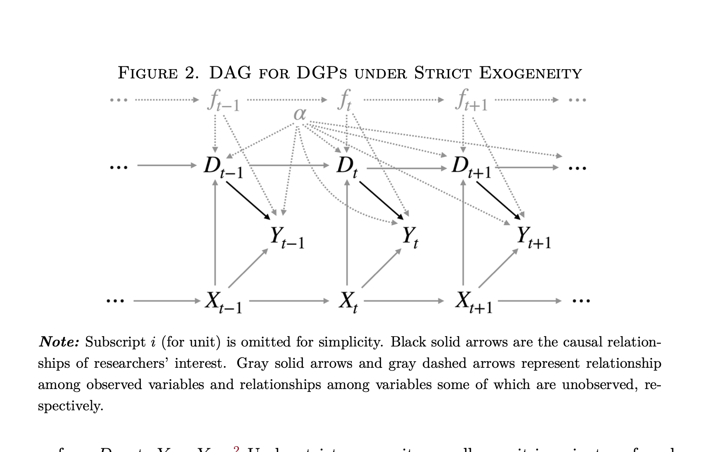
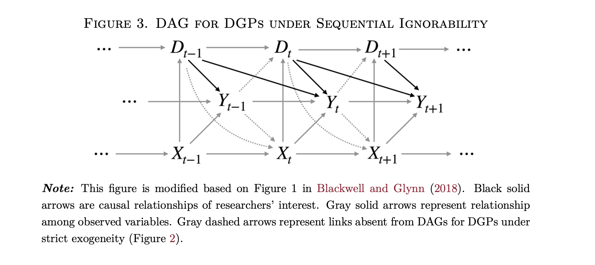
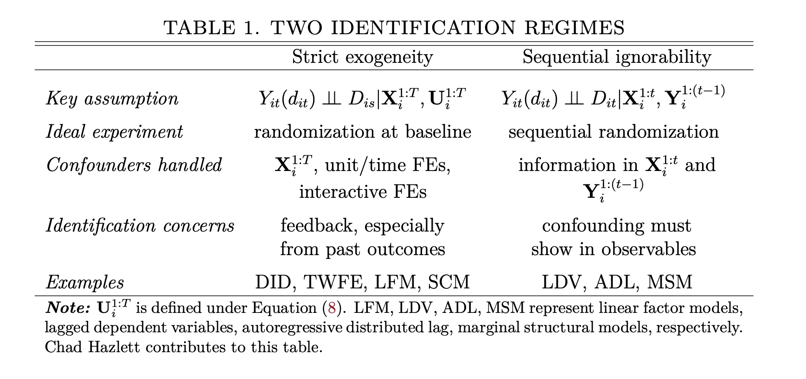

# Time-Series Cross-Section (TSCS)

## Introdução

No capítulo sobre Diferença em Diferenças, vimos que o modelo TWFE pode ser interpretado como uma forma de DiD generalizado quando o tratamento é binário, há vários períodos e as tendências paralelas são plausíveis. Esse resultado organiza parte do problema, mas ele não esgota o que precisamos entender sobre dados de painel.

A pergunta agora é outra: o que acontece quando usamos apenas um efeito fixo? O que muda quando usamos vários efeitos fixos, como município, estado e ano? O que sobra para identificar o coeficiente quando os efeitos fixos absorvem parte da variação do tratamento? E como devemos interpretar um TWFE quando o tratamento é contínuo, e não apenas uma variável binária de tratado e controle?

Essas perguntas são menos sobre um estimador específico e mais sobre a estrutura da comparação. Efeitos fixos removem variação. O coeficiente de uma regressão com efeitos fixos é estimado apenas com a variação que resta depois dessa remoção. A tarefa do pesquisador é dizer se essa variação residual pode ser interpretada causalmente.

**Quadro-guia.** A lógica do capítulo é a seguinte:

| Operação | O que remove | Pergunta que fica |
|---|---|---|
| Efeito fixo de unidade | Diferenças permanentes entre unidades | A unidade muda quando seu próprio tratamento muda? |
| Efeito fixo de tempo | Choques comuns de cada período | Unidades mais expostas diferem das menos expostas no mesmo período? |
| Múltiplos efeitos fixos | Mais dimensões de comparação | Que variação do tratamento ainda resta? |
| Pressuposto causal | Interpretação não vem da regressão | A variação residual pode ser tratada como exógena? |

Dados de painel são definidos como observações repetidas de uma mesma unidade $i = 1, \ldots, N$ no período $t = 1, \ldots, T$. O termo tem origem em surveys em ondas, em que o mesmo indivíduo era rastreado ao longo do tempo. Em ciência política também chamamos esse tipo de dado de **Time-Series Cross-Section**, ou TSCS. A distinção foi introduzida porque surveys em ondas tipicamente possuem $T$ pequeno, enquanto dados TSCS comuns em política comparada, Relações Internacionais e políticas públicas costumam ter $T$ maior: países da OCDE ao longo de cinquenta anos, estados brasileiros ao longo de trinta anos, municípios ao longo de várias eleições.

Uma observação de uma variável dependente e uma variável independente é dada pelo par $(y_{it}, x_{it})$, em que $i$ indexa a unidade e $t$ indexa o tempo.

Tradicionalmente a literatura categorizava os dados de painel em balanceados, quando todas as unidades são observadas nos mesmos períodos, e não balanceados, quando algumas unidades têm períodos ausentes. Essa terminologia pode confundir com a ideia de balanceamento em matching. Uma alternativa mais clara é falar em painéis completos e incompletos.

Em TSCS, incompletude nem sempre significa dado ausente. Países deixam de existir, como a URSS e a Iugoslávia, e outros são criados, como Sérvia e Montenegro. O mesmo vale para estados e municípios. Não é óbvio que devemos tratar esse problema como ausência de informação. A entidade pode simplesmente não existir em parte da série. Em meu doutorado, por exemplo, estudei o efeito de regimes políticos sobre a adesão a tratados de patentes. Não é claro se a adesão da URSS em um período $t^{\star}$ deve ser atribuída à Rússia em períodos $t > t^{\star}$. E no caso da Iugoslávia? Essas decisões são substantivas e metodológicas.

Os dados podem ser organizados em dois formatos: **long** e **wide**. O formato long, que é o padrão em análise de dados, organiza a base com uma linha por unidade-período. O formato wide coloca cada unidade em uma única linha e distribui os períodos em colunas.


## Variação within e between

Uma distinção importante em dados de painel é entre variação *within* e variação *between*. A variação *between* compara unidades diferentes. A variação *within* compara a mesma unidade consigo mesma ao longo do tempo.

Imagine que temos uma variável $x_{it}$ medida para $N$ indivíduos em $T$ períodos. Podemos calcular três médias:

1. Média individual:
$$
\bar{x}_i = \frac{1}{T}\sum_{t=1}^T x_{it}.
$$

2. Média temporal:
$$
\bar{x}_t = \frac{1}{N}\sum_{i=1}^N x_{it}.
$$

3. Média geral:
$$
\bar{x} = \frac{1}{NT}\sum_{i=1}^N\sum_{t=1}^T x_{it}.
$$

A variação *between* mede quanto as médias das unidades diferem da média geral:
$$
B = \sum_{i=1}^N T_i(\bar{x}_i - \bar{x})^2.
$$
Se o painel é completo, $T_i = T$ para todas as unidades.

A variação *within* mede quanto cada observação se afasta da média da própria unidade:
$$
W = \sum_{i=1}^N \sum_{t=1}^{T_i}(x_{it} - \bar{x}_i)^2.
$$

A variação total em torno da média geral pode ser decomposta em:
$$
\sum_{i=1}^N\sum_{t=1}^{T_i} (x_{it} - \bar{x})^2 = W + B.
$$

Essa decomposição é útil porque efeitos fixos decidem qual parte da variação será usada pelo estimador. Se removemos as diferenças fixas entre unidades, o coeficiente será estimado com variação dentro das unidades. Se removemos choques comuns a cada período, o coeficiente será estimado com comparações dentro do mesmo período. Com muitos efeitos fixos, a variação que resta pode ser pequena e substantivamente estreita.

## Efeitos fixos como residualização

A forma mais simples de entender efeitos fixos é pensar em residualização. Um efeito fixo remove a média de uma dimensão da base. Depois disso, a regressão usa apenas o que sobrou.

```{r fe-residualizacao-diagrama, echo=FALSE, fig.cap="Efeitos fixos como residualiza\u00e7\u00e3o. A regress\u00e3o final usa apenas a varia\u00e7\u00e3o que permanece depois de remover as dimens\u00f5es absorvidas pelos efeitos fixos.", fig.width=7, fig.height=1.6}
op <- par(mar = c(0, 0, 0, 0))
plot.new()
plot.window(xlim = c(0, 1), ylim = c(0, 1))

xs <- c(0.10, 0.36, 0.62, 0.88)
labels <- c(
  "Y_it, X_it",
  "remove FE\nde unidade",
  "remove FE\nde tempo/grupo",
  "coeficiente\ncom variacao residual"
)

for (j in seq_along(xs)) {
  rect(xs[j] - 0.095, 0.30, xs[j] + 0.095, 0.70, col = "#F3F6FA", border = "#3A5F7D", lwd = 1.2)
  text(xs[j], 0.50, labels[j], cex = 0.86)
  if (j < length(xs)) {
    arrows(xs[j] + 0.105, 0.50, xs[j + 1] - 0.105, 0.50, length = 0.08, col = "#555555", lwd = 1.2)
  }
}
par(op)
```

Considere uma mini-base com três municípios observados em três anos. Os municípios A e B pertencem ao mesmo estado; C pertence a outro. A coluna `x` é a variável de tratamento ou exposição. As demais colunas mostram o que sobra depois de diferentes formas de residualização.

```{r toy-panel-residualization, echo=FALSE, results='asis'}
toy <- expand.grid(
  municipio = c("A", "B", "C"),
  ano = 2020:2022,
  KEEP.OUT.ATTRS = FALSE
)
toy <- toy[order(toy$municipio, toy$ano), ]
toy$estado <- ifelse(toy$municipio %in% c("A", "B"), "SP", "BA")
toy$x <- c(2, 3, 5, 4, 4, 6, 7, 8, 8)

toy$res_mun <- toy$x - ave(toy$x, toy$municipio)
toy$res_mun_ano <- as.numeric(resid(lm(x ~ factor(municipio) + factor(ano), data = toy)))
toy$res_mun_estado_ano <- as.numeric(resid(lm(x ~ factor(municipio) + factor(estado):factor(ano), data = toy)))

toy_out <- data.frame(
  Municipio = toy$municipio,
  Estado = toy$estado,
  Ano = toy$ano,
  x = toy$x,
  `x apos FE municipio` = round(toy$res_mun, 2),
  `x apos FE municipio + ano` = round(toy$res_mun_ano, 2),
  `x apos FE municipio + estado-ano` = round(toy$res_mun_estado_ano, 2),
  check.names = FALSE
)
names(toy_out) <- c(
  "Munic\u00edpio",
  "Estado",
  "Ano",
  "x",
  "x ap\u00f3s FE munic\u00edpio",
  "x ap\u00f3s FE munic\u00edpio + ano",
  "x ap\u00f3s FE munic\u00edpio + estado-ano"
)

knitr::kable(
  toy_out,
  caption = "Mini-base para visualizar a varia\u00e7\u00e3o que sobra depois de diferentes efeitos fixos."
)
```

Note a lógica: efeitos fixos de município removem diferenças persistentes entre A, B e C; efeitos fixos de ano removem choques comuns a todos; efeitos fixos de estado-ano deixam apenas comparações dentro do mesmo estado e ano. Como C é o único município de seu estado nesta mini-base, a especificação com município e estado-ano deixa pouca informação útil para C. Esse é exatamente o tipo de perda de variação que pode ocorrer em aplicações reais.

**Pausa.** Antes de interpretar qualquer coeficiente com efeitos fixos, faça três perguntas:

1. Quem está sendo comparado com quem?
2. Qual variação do tratamento sobrou depois dos efeitos fixos?
3. Qual hipótese torna essa variação residual plausivelmente causal?

Considere o modelo:
$$
y_{it} = \alpha_i + \beta x_{it} + u_{it}.
$$

O efeito fixo de unidade, $\alpha_i$, captura tudo que é fixo na unidade ao longo do tempo: geografia, história institucional, cultura política persistente, características de origem, ou qualquer outro atributo que não muda no período analisado. Se subtraímos a média da unidade de cada variável, obtemos:
$$
y_{it} - \bar{y}_i = \beta (x_{it} - \bar{x}_i) + (u_{it} - \bar{u}_i).
$$

Definindo $\tilde{y}_{it} = y_{it} - \bar{y}_i$ e $\tilde{x}_{it} = x_{it} - \bar{x}_i$, temos:
$$
\tilde{y}_{it} = \beta \tilde{x}_{it} + \tilde{u}_{it}.
$$

Essa é a intuição do estimador de efeitos fixos: ele compara cada unidade consigo mesma. Toda variável que não muda dentro da unidade desaparece da equação. Isso é uma vantagem quando a fonte de confusão é invariante no tempo. Também é um custo, pois qualquer variável de interesse sem variação dentro da unidade não pode ser estimada.

### Um efeito fixo

Com apenas efeito fixo de unidade:
$$
y_{it} = \alpha_i + \beta x_{it} + u_{it},
$$
o coeficiente $\beta$ é identificado pela variação de $x_{it}$ dentro da unidade ao longo do tempo. Esse modelo controla características fixas da unidade, mas não controla choques comuns a todos em determinado período.

Com apenas efeito fixo de tempo:
$$
y_{it} = \lambda_t + \beta x_{it} + u_{it},
$$
o coeficiente $\beta$ é identificado por diferenças entre unidades dentro do mesmo período. Esse modelo controla choques comuns de tempo, mas não controla diferenças fixas entre unidades.

Os dois modelos respondem a perguntas diferentes. O primeiro pergunta se uma unidade tem valores maiores de $y$ nos períodos em que seu próprio $x$ está maior. O segundo pergunta se, em um mesmo período, unidades com maior $x$ têm maior $y$.

### Dois efeitos fixos

Com efeitos fixos de unidade e tempo:
$$
y_{it} = \alpha_i + \lambda_t + \beta x_{it} + u_{it},
$$
o coeficiente é estimado com a variação de $x_{it}$ que permanece depois de remover diferenças médias entre unidades e diferenças médias entre períodos.

Esse é o caso que vimos no capítulo de DiD. Quando $x_{it}$ é um indicador binário de tratamento, o TWFE pode ser interpretado como uma generalização do DiD sob pressupostos apropriados. A interpretação com uma variável contínua é diferente. O coeficiente não compara simplesmente tratados e controles. Ele mede uma inclinação: quanto $y$ muda, em média, quando a parte residual de $x$ aumenta uma unidade.

### Mais de dois efeitos fixos

Em aplicações reais, usamos frequentemente mais de dois efeitos fixos. Isso muda a comparação efetiva.

Considere um painel de municípios ao longo do tempo:
$$
y_{imt} = \alpha_m + \lambda_t + \beta x_{imt} + u_{imt},
$$
em que $m$ indexa municípios. O efeito fixo de município remove diferenças permanentes entre municípios. O efeito fixo de tempo remove choques comuns a todos os municípios em cada período.

Agora suponha que adicionamos efeitos fixos de estado-ano:
$$
y_{imt} = \alpha_m + \delta_{st} + \beta x_{imt} + u_{imt},
$$
em que $\delta_{st}$ é um efeito fixo para cada combinação entre estado $s$ e período $t$. O coeficiente passa a ser identificado por variação entre municípios dentro do mesmo estado e no mesmo período, depois de controlar diferenças fixas entre municípios. Choques específicos de São Paulo em 2018, Bahia em 2018, São Paulo em 2019, e assim por diante, são absorvidos.

Isso pode ser desejável quando há choques estaduais que afetariam simultaneamente o tratamento e o outcome. Mas também pode remover a própria variação do tratamento. Se $x_{imt}$ varia apenas no nível estado-ano, então $\delta_{st}$ absorve completamente $x_{imt}$ e o coeficiente não pode ser estimado.

Também é comum encontrar efeitos fixos redundantes. Se cada município pertence a apenas um estado, então efeitos fixos de município já absorvem diferenças fixas entre estados. Nesse caso, adicionar efeitos fixos de estado não acrescenta controle substantivo; eles são colineares com os efeitos fixos de município.

Uma regra prática é perguntar: depois de todos os efeitos fixos, quem está sendo comparado com quem? Se a resposta não é clara, a interpretação do coeficiente também não é clara.

### Tratamento contínuo

Quando o tratamento é contínuo, a interpretação do TWFE precisa ser formulada em termos de dose ou intensidade. O modelo:
$$
y_{it} = \alpha_i + \lambda_t + \beta d_{it} + u_{it}
$$
estima a associação entre a parte residual da dose $d_{it}$ e a parte residual de $y_{it}$.

Se $d_{it}$ mede o valor de uma transferência federal por habitante, por exemplo, $\beta$ indica a mudança esperada em $y$ associada a uma unidade adicional dessa transferência, depois de remover médias de unidade e de tempo. Essa interpretação depende de três condições.

Primeiro, deve haver suporte. Precisamos observar unidades comparáveis com diferentes níveis residuais de dose. Segundo, a forma funcional linear precisa ser razoável no intervalo de doses observado. Terceiro, a variação residual da dose precisa ser plausivelmente exógena, dado o conjunto de efeitos fixos e controles.

Com tratamento binário, a pergunta típica é sobre a diferença entre estar tratado e não estar tratado. Com tratamento contínuo, a pergunta passa a ser sobre a curva dose-resposta. Se o efeito de sair de 0 para 1 é diferente do efeito de sair de 10 para 11, um único coeficiente linear pode esconder heterogeneidade substantiva.

## OVB e efeitos fixos

O principal atrativo dos efeitos fixos é lidar com viés de variável omitida causado por características não observadas e invariantes no tempo.

Suponha o DAG abaixo, em que $a$ é uma variável invariante no tempo e não observada:

```{r dag-fe, fig.cap="DAG de OVB com confundidor fixo n\u00e3o observado. O painel ajuda quando a fonte de confus\u00e3o, aqui representada por $a_i$, \u00e9 constante dentro da unidade ao longo do tempo."}
library(ggdag)
dag <- dagify(
  y ~ x + a,
  x ~ a,
  latent = "a"
)

ggdag(dag)
```

Essa estrutura leva ao problema clássico de variável omitida. Dados de painel nos permitem remover essa variável de confusão quando ela é fixa na unidade. Suponha a forma paramétrica:
$$
y_{it} = \alpha + \beta_0 x_{it} + a_i + e_{it}.
$$

**Box técnico (para leitura ou backup).** A derivação abaixo mostra, passo a passo, como a centralização por unidade remove $a_i$. Em uma aula oral curta, a mensagem principal é apenas que subtrair a média da unidade elimina tudo que é constante dentro dela.

Para simplificar, suponha que o painel é completo. A média da unidade é:
$$
\begin{aligned}
\bar{y}_i &= \frac{1}{T}\sum_{t=1}^T y_{it} \\
         &= \frac{1}{T}\sum_{t=1}^T (\alpha + \beta_0 x_{it} + a_i + e_{it}) \\
         &= \alpha + \beta_0 \bar{x}_i + a_i + \bar{e}_i.
\end{aligned}
$$

Subtraindo essa média da equação original:
$$
\begin{aligned}
y_{it} - \bar{y}_i
  &= \alpha + \beta_0 x_{it} + a_i + e_{it}
     - (\alpha + \beta_0 \bar{x}_i + a_i + \bar{e}_i) \\
  &= \beta_0(x_{it} - \bar{x}_i) + (e_{it} - \bar{e}_i).
\end{aligned}
$$

O termo $a_i$ desaparece. Isso mostra exatamente o que efeitos fixos fazem: eles removem a parte da confusão que é constante dentro da unidade.

A pergunta causal permanece. Depois de remover $a_i$, a variação de $x_{it} - \bar{x}_i$ pode ser tratada como exógena? A resposta depende do desenho, do tratamento e dos pressupostos de identificação.

## Efeitos aleatórios e Mundlak

Efeitos fixos não são a única forma de modelar heterogeneidade entre unidades. Uma alternativa é o modelo de efeitos aleatórios. Um modelo simples pode ser escrito como:
$$
y_{it} = \beta_0 + \beta_1 x_{it} + \mu_i + e_{it},
$$
em que $\mu_i$ é um intercepto específico da unidade.

No modelo de efeitos aleatórios, assumimos tipicamente que:
$$
\mu_i \sim N(0, \sigma^2_{\mu})
$$
e
$$
e_{it} \sim N(0, \sigma^2_e).
$$

Isso também pode ser entendido como *partial pooling*. Se $\sigma^2_{\mu} = 0$, todas as unidades têm o mesmo intercepto e temos uma regressão pooled. Se $\sigma^2_{\mu}$ é muito grande, cada unidade pode ter um intercepto muito diferente das demais, aproximando uma regressão com efeitos fixos.

A suposição substantiva forte é:
$$
\mathbb{E}[\mu_i \mid x_{i1}, x_{i2}, \ldots, x_{iT}] = 0.
$$

Em palavras, o intercepto específico da unidade não pode estar correlacionado com a trajetória do tratamento ou da variável independente. Essa suposição é frequentemente implausível em ciência política. Municípios com maior capacidade estatal, por exemplo, podem ter níveis médios maiores de gasto, maior probabilidade de receber programas e melhores outcomes.

Textos de econometria costumam apresentar essa escolha como uma decisão entre efeitos fixos e efeitos aleatórios usando o teste de Hausman. A hipótese nula do teste é que o estimador de efeitos aleatórios é consistente. Em termos substantivos, isso quer dizer que a heterogeneidade não observada da unidade, $\mu_i$, não está correlacionada com os regressores. Sob essa hipótese, efeitos fixos e efeitos aleatórios estimam o mesmo parâmetro, mas efeitos aleatórios é mais eficiente. Se rejeitamos a nula, a diferença entre os dois estimadores é sistemática, o que sugere que efeitos aleatórios está usando variação contaminada pela correlação entre $\mu_i$ e $x_{it}$.

O teste de Hausman é útil como diagnóstico, mas não resolve sozinho a pergunta causal. Ele testa uma implicação estatística da especificação, não prova que efeitos fixos identificam um efeito causal. A correção de Mundlak ajuda justamente porque torna explícita a fonte do problema: em vez de assumir que $\mu_i$ é independente da trajetória de $x_{it}$, adicionamos ao modelo a média da unidade, $\bar{x}_i$. Se $\bar{x}_i$ explica $y_{it}$, há evidência de que a variação *between* carrega informação diferente da variação *within*. Nesse sentido, testar os coeficientes das médias de unidade em um modelo de efeitos aleatórios correlacionados é uma forma direta de perguntar se a hipótese forte dos efeitos aleatórios é plausível.

Bell e Jones, seguindo Mundlak, mostram uma forma útil de enxergar o problema. A variável $x_{it}$ pode ser decomposta em dois componentes:
$$
x_{it} = \bar{x}_i + (x_{it} - \bar{x}_i).
$$

O primeiro termo, $\bar{x}_i$, captura diferenças entre unidades. O segundo, $x_{it} - \bar{x}_i$, captura variação dentro da unidade ao longo do tempo. Um modelo de efeitos aleatórios que inclui a média da unidade separa essas duas fontes de variação:
$$
y_{it} = \beta_0 + \beta_W (x_{it} - \bar{x}_i) + \beta_B \bar{x}_i + \mu_i + e_{it}.
$$

Aqui, $\beta_W$ é o efeito associado à variação *within*, e $\beta_B$ é o efeito associado à variação *between*. Quando os dois são diferentes, um modelo que impõe um único coeficiente para $x_{it}$ mistura processos distintos.

## Histórias de tratamento e estimandos

Em dados TSCS, o tratamento de hoje pode depender do tratamento de ontem, e o resultado de hoje pode depender da história inteira do tratamento. Por isso, precisamos falar de histórias.

Todos os tratamentos recebidos por uma unidade formam a história do tratamento:
$$
X_i = \{x_{i1}, x_{i2}, \ldots, x_{iT}\}.
$$

A história parcial até $t$ é:
$$
X_{i,1:t} = \{x_{i1}, x_{i2}, \ldots, x_{it}\}.
$$

Com tratamento binário, se a ordem importa, cada sequência é substantivamente distinta. Um país que foi democracia nos cinco primeiros períodos e ditadura nos cinco últimos pode não ser comparável a um país que viveu a sequência inversa, mesmo que ambos tenham o mesmo número total de períodos democráticos.

De maneira geral, podemos escrever:
$$
Y_{it}(x_{i1}, x_{i2}, \ldots, x_{it}).
$$

Se a ordem não importa e apenas a dose acumulada importa, podemos escrever uma restrição mais forte:
$$
Y_{it}(x_{i1}, x_{i2}, \ldots, x_{it}) =
Y_{it}\left(\sum_{s=1}^t x_{is}\right).
$$

Há muitos estimandos possíveis. Podemos estar interessados no efeito de uma história completa de tratamento:
$$
\tau_{X,X'} =
\mathbb{E}[Y_{it}(X_{i,1:t}) - Y_{it}(X'_{i,1:t})].
$$

Podemos estar interessados no efeito de uma história recente:
$$
\mathbb{E}[Y_{it}(X_{i,t-j:t}) - Y_{it}(X'_{i,t-j:t})].
$$

Ou podemos estar interessados em um efeito contemporâneo, mantendo a história passada como dada e alterando apenas o tratamento no período atual:
$$
\tau_c(t) =
\mathbb{E}[Y_{it}(X_{i,1:t-1}, 1) - Y_{it}(X_{i,1:t-1}, 0)].
$$

Essas quantidades são diferentes. O erro comum é estimar um coeficiente em painel e falar em “o efeito do tratamento” sem dizer qual contraste causal está sendo estimado.

## Quatro pressupostos de identificação

Agora podemos separar quatro pressupostos que aparecem com frequência em dados de painel: tendências paralelas, randomização no baseline, exogeneidade estrita e ignorabilidade sequencial. Eles não são a mesma coisa.

A confusão mais comum é tratar tendências paralelas como se fosse apenas outro nome para ignorabilidade. Essa tradução é imprecisa. Ignorabilidade fala sobre atribuição do tratamento. Tendências paralelas fala sobre a evolução do resultado contrafactual sem tratamento.

### Mapa dos pressupostos

```{r pressupostos-matriz, echo=FALSE, results='asis'}
press <- data.frame(
  Pressuposto = c(
    "Tend\u00eancias paralelas",
    "Randomiza\u00e7\u00e3o no baseline",
    "Exogeneidade estrita",
    "Ignorabilidade sequencial"
  ),
  Experimento = c(
    "Tratados e controles teriam evolu\u00eddo da mesma forma sem tratamento",
    "A sequ\u00eancia inteira de tratamento \u00e9 sorteada antes do painel come\u00e7ar",
    "O tratamento n\u00e3o responde a choques passados, presentes ou futuros do outcome",
    "Em cada per\u00edodo, o tratamento \u00e9 atribu\u00eddo condicionalmente \u00e0 hist\u00f3ria observada"
  ),
  Permite = c(
    "DiD/TWFE como compara\u00e7\u00e3o de mudan\u00e7as contrafactuais",
    "Comparar hist\u00f3rias de tratamento como grupos experimentais",
    "Interpretar FE/TWFE sob modelo linear",
    "Estimar regimes din\u00e2micos sob sele\u00e7\u00e3o em observ\u00e1veis"
  ),
  Exclui = c(
    "Sele\u00e7\u00e3o em tend\u00eancias n\u00e3o tratadas",
    "Sele\u00e7\u00e3o din\u00e2mica baseada em resultados passados",
    "Feedback de choques de y para valores futuros de x",
    "Confus\u00e3o n\u00e3o observada variante no tempo"
  ),
  check.names = FALSE
)
names(press) <- c("Pressuposto", "Experimento imagin\u00e1rio", "O que permite", "O que exclui")

cores <- c("#2F6F9F", "#5E8C61", "#9A6B28", "#8A4F7D")
press_visual <- press
press_visual$Pressuposto <- sprintf(
  '<span style="display:inline-block; min-width: 11em; padding: 0.25em 0.45em; border-radius: 3px; color: white; font-weight: 600; background: %s;">%s</span>',
  cores,
  press$Pressuposto
)

knitr::kable(
  press_visual,
  caption = "Mapa dos quatro pressupostos. As cores distinguem fam\u00edlias de suposi\u00e7\u00f5es: tend\u00eancias, atribui\u00e7\u00e3o inicial, exogeneidade de regress\u00e3o e atribui\u00e7\u00e3o sequencial.",
  escape = FALSE
)
```

**Pausa.** Ao escolher uma dessas hipóteses, pergunte: estou fazendo uma afirmação sobre a trajetória contrafactual do outcome, ou sobre o mecanismo de atribuição do tratamento?

### Detalhamento dos pressupostos

### Tendências paralelas

Tendências paralelas é o pressuposto que sustenta o DiD. Em sua forma básica, com dois períodos, o estimando usual para os tratados é:
$$
ATT = \mathbb{E}[Y_{i1}(1)-Y_{i1}(0)\mid D_i=1].
$$

Observamos $Y_{i1}(1)$ para os tratados, mas não observamos $Y_{i1}(0)$. A hipótese de tendências paralelas diz:
$$
\mathbb{E}[Y_{i1}(0)-Y_{i0}(0)\mid D_i=1]
=
\mathbb{E}[Y_{i1}(0)-Y_{i0}(0)\mid D_i=0].
$$

Como antes do tratamento vale $Y_{i0}=Y_{i0}(0)$, usamos a evolução dos controles para imputar o contrafactual dos tratados.

Repare o que essa hipótese não diz. PT não exige:
$$
D_i \perp Y_{i1}(0).
$$

Tratados e controles podem ser diferentes em níveis. O que PT exige é uma igualdade sobre a mudança média do resultado não tratado:
$$
\Delta Y_i(0)=Y_{i1}(0)-Y_{i0}(0),
$$
de modo que:
$$
\mathbb{E}[\Delta Y_i(0)\mid D_i=1]
=
\mathbb{E}[\Delta Y_i(0)\mid D_i=0].
$$

Uma forma compacta de dizer isso é: tendências paralelas é ignorabilidade em média da mudança contrafactual não tratada. Não é ignorabilidade dos níveis. Não é ignorabilidade de todos os resultados potenciais. É uma restrição sobre a evolução média de $Y(0)$.

Em vários períodos, a mesma ideia pode ser escrita como:
$$
\mathbb{E}[Y_{it}(0) - Y_{is}(0) \mid D_i = 1]
=
\mathbb{E}[Y_{it}(0) - Y_{is}(0) \mid D_i = 0].
$$

Essa formulação mostra a intuição fundamental do DiD: ele tolera seleção em níveis, desde que não haja seleção em tendências. Se:
$$
Y_{it}(0)=\alpha_i+\lambda_t+\varepsilon_{it}
$$
e unidades com $\alpha_i$ alto têm maior probabilidade de tratamento, ignorabilidade em níveis falha. Mas, ao tomar diferenças no tempo, $\alpha_i$ desaparece. O problema aparece quando unidades tratadas e controles têm tendências próprias diferentes. Por exemplo:
$$
Y_{it}(0)=\alpha_i+\lambda_t+\gamma_i t+\varepsilon_{it},
$$
com $\gamma_i$ correlacionado com o tratamento. Nesse caso, efeitos fixos simples removem diferenças de nível, mas não removem seleção em tendências.

Com tratamento contínuo, a versão de PT precisa ser formulada em termos de dose. A pergunta deixa de ser se tratados e controles teriam tendências paralelas. A pergunta passa a ser se unidades com diferentes intensidades de dose teriam trajetórias contrafactuais comparáveis, depois de condicionar no desenho escolhido.

Com covariáveis, podemos formular tendências paralelas condicionais:
$$
\mathbb{E}[\Delta Y_i(0)\mid D_i=1,X_i]
=
\mathbb{E}[\Delta Y_i(0)\mid D_i=0,X_i].
$$

Isso importa porque ignorabilidade condicional não implica automaticamente tendências paralelas incondicionais. Se o tratamento depende de $Y_{i0}$ e há regressão à média, tratados e controles podem ter mudanças contrafactuais diferentes mesmo quando a atribuição é ignorável dado o outcome inicial. Nesse caso, precisamos condicionar ou reponderar.

### Randomização no baseline

Randomização no baseline é mais forte. O experimento imaginário é sortear, antes do início do painel, a sequência inteira de tratamento que cada unidade receberá:
$$
X_i = (x_{i1}, x_{i2}, \ldots, x_{iT}).
$$

Se a sequência é sorteada no baseline, podemos comparar unidades com diferentes histórias de tratamento como em um experimento. Por exemplo, podemos comparar unidades que receberam $(1,1)$ com unidades que receberam $(0,0)$ em um painel de dois períodos.

Nesse caso, de quatro resultados potenciais possíveis,
$$
Y_i(0,0), \quad Y_i(0,1), \quad Y_i(1,0), \quad Y_i(1,1),
$$
observamos apenas um para cada unidade. Mas a atribuição aleatória da sequência permite recuperar médias causais comparando grupos com diferentes sequências observadas.

Essa suposição é útil como referência conceitual, mas raramente descreve processos políticos reais. Políticas, regimes e programas públicos costumam responder a eventos anteriores. Quando a atribuição muda em resposta à história observada, entramos no terreno da ignorabilidade sequencial.

### Exogeneidade estrita

Exogeneidade estrita é uma suposição típica de modelos lineares de painel. Uma forma de escrevê-la é:
$$
\mathbb{E}[u_{it} \mid x_{i1}, x_{i2}, \ldots, x_{iT}, \alpha_i, \lambda_1, \ldots, \lambda_T] = 0
\quad \text{para todo } i,t.
$$

Ela exige que o erro em $t$ não esteja correlacionado com valores passados, presentes ou futuros de $x$. Isso exclui feedback de choques no outcome para o tratamento futuro. Se um choque positivo em $y_{it}$ aumenta a chance de receber tratamento em $t+1$, então $x_{i,t+1}$ estará correlacionado com $u_{it}$ e a exogeneidade estrita falha.

O DAG abaixo apresenta exogeneidade estrita para um caso simplificado de três períodos:

```{r strict-exogeneity-dag, echo=FALSE, fig.cap="Exogeneidade estrita. O tratamento em cada per\u00edodo n\u00e3o pode responder a choques passados do outcome nem antecipar choques futuros; por isso, a hip\u00f3tese exclui feedback din\u00e2mico entre resultado e tratamento."}

```

Em um modelo estático, exogeneidade estrita também se torna problemática quando o tratamento tem efeitos defasados omitidos. Se $x_{i,t-1}$ afeta $y_{it}$, mas o modelo inclui apenas $x_{it}$, parte do efeito passado fica no erro. Como tratamentos são frequentemente persistentes, esse erro pode estar correlacionado com o tratamento presente.

### Ignorabilidade sequencial

Ignorabilidade sequencial relaxa a ideia de que o tratamento não pode responder ao passado. O experimento imaginário é diferente: em cada período, o tratamento é atribuído condicionalmente à história observada da unidade.

Defina a história observada antes do tratamento em $t$ como:
$$
H_{it} = (\bar{Y}_{i,t-1}, \bar{A}_{i,t-1}, \bar{X}_{it}).
$$
Aqui, $H_{it}$ contém outcomes passados, tratamentos passados e covariáveis observadas até o momento da decisão de tratamento.

Se $A_{it}$ é o tratamento no período $t$ e $\bar{a}$ é uma trajetória completa de tratamento, a suposição pode ser escrita como:
$$
A_{it}
\perp
\{Y_{is}(\bar a): s\geq t,\ \bar a\in\mathcal A^T\}
\mid H_{it}.
$$

Em palavras, dado tudo que observei até antes da atribuição do tratamento em $t$, o tratamento atual é independente dos resultados potenciais futuros. Isso permite que tratamento dependa de resultados passados observados. Um município pode receber uma política porque teve baixo desempenho no ano anterior. A suposição exige que, depois de condicionar nesse histórico observado, não reste confusão não observada que afete tanto o tratamento quanto os resultados potenciais.

No caso simples de um tratamento após o período pré, essa hipótese se aproxima de:
$$
D_i \perp \{Y_{i1}(0),Y_{i1}(1)\}\mid Y_{i0},X_i.
$$

Essa é uma hipótese de seleção em observáveis. Ela é diferente de PT. PT pode valer quando ignorabilidade em níveis falha, porque DiD remove diferenças fixas de nível. E ignorabilidade condicional pode valer sem que PT incondicional valha, porque tratados e controles podem ter diferentes valores iniciais e regressão à média.

O DAG abaixo ilustra a suposição de ignorabilidade sequencial.

```{r sequential-ignorability-dag, echo=FALSE, fig.cap="Ignorabilidade sequencial. O tratamento pode responder \u00e0 hist\u00f3ria observada; a hip\u00f3tese exige que, ap\u00f3s condicionar nessa hist\u00f3ria, n\u00e3o reste confus\u00e3o n\u00e3o observada para os resultados potenciais futuros."}

```

Essa suposição costuma exigir estimadores próprios, como modelos marginais estruturais, IPW, g-formula ou métodos relacionados. Incluir controles contemporâneos em uma regressão TWFE nem sempre resolve o problema, especialmente se esses controles foram afetados por tratamentos passados.

### TWFE, FE e RE nessa linguagem

A regressão TWFE é:
$$
Y_{it}=\alpha_i+\lambda_t+\tau A_{it}+u_{it}.
$$

Uma leitura em resultados potenciais é:
$$
Y_{it}(0)=\alpha_i+\lambda_t+u_{it}(0),
$$
e, se o efeito for constante:
$$
Y_{it}(1)=Y_{it}(0)+\tau.
$$

Para interpretar $\tau$ causalmente, precisamos de uma condição sobre o erro do resultado não tratado. Em linguagem de regressão, isso se parece com:
$$
\mathbb{E}[u_{it}(0)\mid A_{i1},\ldots,A_{iT},\alpha_i,\lambda_t]=0.
$$

Em linguagem de DiD, isso se parece mais com PT no resíduo:
$$
\mathbb{E}[u_{it}(0)-u_{is}(0)\mid \text{tratados}]
=
\mathbb{E}[u_{it}(0)-u_{is}(0)\mid \text{controles}].
$$

TWFE incorpora a intuição do DiD porque remove $\alpha_i$ e $\lambda_t$. Mas o coeficiente TWFE só tem interpretação causal simples sob condições adicionais, como ausência de antecipação, especificação correta da comparação, e cuidado com heterogeneidade de efeitos em desenhos escalonados.

Efeitos fixos permitem que a heterogeneidade fixa da unidade esteja correlacionada com o tratamento:
$$
D_i \not\!\perp \alpha_i.
$$

Essa é justamente sua vantagem em relação a efeitos aleatórios. Em efeitos aleatórios, em geral assumimos algo mais forte:
$$
\mathbb{E}[\alpha_i\mid \bar A_i,\bar X_i]=\mathbb{E}[\alpha_i].
$$

Ou seja, a heterogeneidade não observada fixa da unidade não pode estar correlacionada com a trajetória de tratamento. Para identificação causal em painel, FE conversa naturalmente com PT; RE conversa mais naturalmente com uma hipótese de ausência de seleção na heterogeneidade não observada.

## Modelos dinâmicos e feedback

A distinção entre exogeneidade estrita e ignorabilidade sequencial fica clara quando pensamos em modelos dinâmicos.

Considere um Distributed Lag Model (DLM), que inclui valores defasados do tratamento:
$$
y_{it} = \alpha + \beta_1 x_{it} + \beta_2 x_{i,t-1} + \cdots + \beta_k x_{i,t-k} + e_{it}.
$$

Um modelo relacionado é o ADL, *autoregressive distributed lag*, que inclui a variável dependente defasada:
$$
y_{it} = \alpha + \alpha_1 y_{i,t-1} + \beta_1 x_{it} + \beta_2 x_{i,t-1} + e_{it}.
$$

A equação de resultados potenciais implicada por esse modelo pode ser escrita como:
$$
Y_{it}(x_{i,1:t}) =
\alpha + \alpha_1 Y_{i,t-1}(x_{i,1:t-1})
+ \beta_1x_{it} + \beta_2 x_{i,t-1} + e_{it}.
$$

Essa formulação mostra por que a interpretação causal de $x_{i,t-1}$ é difícil. O tratamento passado pode ter efeito direto sobre $y_{it}$, via $\beta_2$, e efeito indireto via $y_{i,t-1}$.

Agora considere o modelo AR(1):
$$
y_t = \beta_0 + \beta_1 y_{t-1} + e_t.
$$

Suponha que:
$$
\mathbb{E}[e_t \mid y_{t-1}, y_{t-2}, \ldots] = 0.
$$

Então:
$$
\mathbb{E}[y_t \mid y_{t-1}, y_{t-2}, \ldots]
= \beta_0 + \beta_1 y_{t-1}.
$$

Como $y_t$ contém $e_t$, o erro atual está mecanicamente relacionado ao resultado atual. Quando modelos de painel incluem variável dependente defasada e efeitos fixos, surgem problemas adicionais, especialmente com $T$ pequeno. A lição substantiva para esta aula é mais simples: dinâmica e feedback exigem que o pesquisador seja explícito sobre o pressuposto de identificação.

## Suposições para inferência

Identificação não resolve inferência. Para calcular erros-padrão e fazer testes de hipótese, precisamos lidar com dependência serial e agrupamento.

### Correlação serial

Em painéis, erros da mesma unidade em períodos diferentes costumam ser correlacionados:
$$
\operatorname{Corr}(u_{it}, u_{is} \mid X_i) \neq 0
\quad \text{para } t \neq s.
$$

Correlação serial afeta principalmente o cálculo dos erros-padrão. Ela não cria, por si só, viés no coeficiente. Mas, se ignoramos essa dependência, a incerteza estimada tende a ser pequena demais. @bertrand2004 mostram isso de forma clara para DiD: em painéis com muitos anos, outcomes persistentes e tratamentos que também permanecem ligados após a adoção, erros-padrão convencionais podem rejeitar a hipótese nula com frequência muito maior do que deveriam. O problema não é que o coeficiente esteja necessariamente errado. O problema é que estamos contando como informação independente observações que, na prática, carregam choques parecidos ao longo do tempo.

A regra prática é clusterizar no nível em que a variação de tratamento é atribuída ou no nível em que os choques estão correlacionados. Se a política varia por município, clusterize por município. Se a política varia por estado, clusterize por estado. Se o tratamento é nacional e varia apenas no tempo, o problema é mais difícil: há pouca variação independente para inferência causal.

Há, porém, um caso em que correlação serial também pode sinalizar problema causal. Suponha que um choque negativo em $y_{i,t-1}$ aumente a probabilidade de uma política em $t$. Se os erros são serialmente correlacionados, esse choque passado também está relacionado ao erro em $t$. O tratamento passa então a responder a um componente do outcome que continua afetando o outcome futuro. Um exemplo simples: municípios recebem intervenção porque tiveram uma piora fiscal no ano anterior, e essa piora fiscal tende a persistir. Comparar esses municípios com outros sem modelar essa regra de seleção pode atribuir à política uma trajetória que já teria sido diferente mesmo sem tratamento.

Nesse caso, o problema não é apenas o erro-padrão. A exogeneidade estrita falha, porque $x_{it}$ responde a choques passados de $y$. Tendências paralelas também ficam ameaçadas, pois tratados e controles podem ter tendências contrafactuais diferentes depois do choque. A ignorabilidade sequencial é uma alternativa conceitual: ela permite que o tratamento responda ao passado observado, mas exige condicionar adequadamente na história que determina a atribuição do tratamento.

### Raiz unitária

Uma segunda fonte de persistência é a raiz unitária. A intuição é simples. Em uma série sem raiz unitária, choques têm efeito temporário: depois de algum tempo, a série tende a voltar para sua trajetória ou média. Em uma série com raiz unitária, choques têm efeito permanente. O exemplo canônico é:
$$
y_t = y_{t-1} + e_t.
$$

Nesse processo, um choque em $e_t$ altera não apenas $y_t$, mas também o ponto de partida de todos os períodos seguintes. A série passa a ter uma tendência estocástica. Por isso, regressões em níveis com séries que têm raiz unitária podem produzir relações aparentemente fortes apenas porque as séries se movem persistentemente ao longo do tempo. Aqui, de novo, o primeiro problema é de inferência e especificação: erros-padrão usuais e testes convencionais podem ser enganosos, e pode ser necessário trabalhar com diferenças, tendências, modelos dinâmicos ou diagnósticos específicos de série temporal.

A raiz unitária também pode virar problema causal quando o tratamento responde a choques passados do outcome. Se um choque permanente em $y$ aumenta a probabilidade de tratamento no período seguinte, os tratados entram no pós-tratamento em uma trajetória contrafactual diferente. Por exemplo, imagine que um município recebe uma política depois de uma queda permanente na arrecadação. Mesmo sem a política, sua trajetória futura de arrecadação já seria diferente da trajetória dos municípios não tratados. Isso ameaça PT. Para defender ignorabilidade sequencial, seria preciso argumentar que a história observada, incluindo o nível e a trajetória recente do outcome, captura a regra de atribuição do tratamento.

## Resumo

A ideia do capítulo é que efeitos fixos definem comparações. Eles removem variação e deixam o coeficiente ser estimado com o que sobra.

```{r checklist-final-painel, echo=FALSE, results='asis'}
checklist <- data.frame(
  Dimensao = c(
    "Unidade-tempo",
    "Varia\u00e7\u00e3o residual",
    "Tratamento",
    "Identifica\u00e7\u00e3o",
    "Infer\u00eancia"
  ),
  Pergunta = c(
    "Qual \u00e9 a unidade e qual \u00e9 o per\u00edodo?",
    "Qual varia\u00e7\u00e3o identifica o coeficiente depois dos efeitos fixos?",
    "O tratamento \u00e9 bin\u00e1rio, cont\u00ednuo, acumulado ou uma hist\u00f3ria?",
    "Qual pressuposto sustenta a interpreta\u00e7\u00e3o causal?",
    "O erro-padr\u00e3o reconhece o n\u00edvel correto de depend\u00eancia nos dados?"
  ),
  check.names = FALSE
)
names(checklist) <- c("Dimens\u00e3o", "Pergunta")

knitr::kable(
  checklist,
  caption = "Checklist final para interpretar modelos de painel com efeitos fixos."
)
```

O DAG abaixo resume diferentes regimes de identificação.

```{r identification-regimes-fig, echo=FALSE, fig.cap="Regimes de identifica\u00e7\u00e3o. Use esta figura como mapa final: cada estimador s\u00f3 \u00e9 interpret\u00e1vel causalmente depois que o pressuposto correspondente foi declarado e defendido."}

```

## Referências

Bell, A., & Jones, K. (2015). Explaining fixed effects: Random effects modeling of time-series cross-sectional and panel data. Political Science Research and Methods, 3(1), 133-153.

Blackwell, M., & Glynn, A. N. (2018). How to make causal inferences with time-series cross-sectional data under selection on observables. American Political Science Review, 112(4), 1067-1082.

Page, S. E. (2006). Path dependence. Quarterly Journal of Political Science, 1(1), 87-115.
