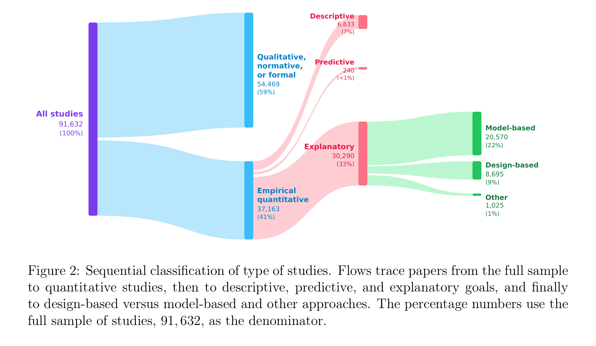
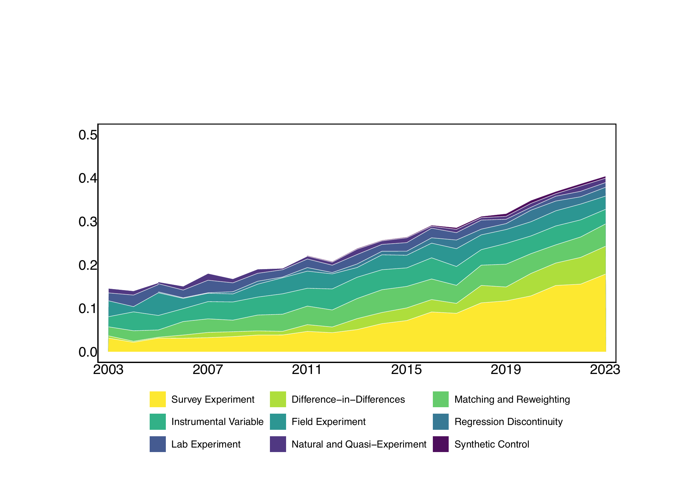

--- 
title: "Curso de Inferência Causal"
author: "Manoel Galdino"
date: "`r Sys.Date()`"
site: bookdown::bookdown_site
---

# Introdução

Escolas que recebem mais recursos financeiros produzem melhores resultados educacionais? Municípios governados por prefeitos reeleitos são mais ou menos corruptos? Programas de transferência de renda reduzem a pobreza? Se olharmos os dados, frequentemente encontramos correlações que sugerem respostas — mas correlação não é causalidade. O desafio central da inferência causal é justamente ir além da associação estatística e identificar relações de causa e efeito a partir de dados observacionais ou experimentais.

Este curso apresenta os principais métodos de inferência causal utilizados em Ciência Política e áreas afins. Começamos pelo modelo de resultados potenciais (*potential outcomes*) e por grafos acíclicos direcionados (DAGs), que fornecem os fundamentos teóricos. Em seguida, estudamos os principais desenhos de pesquisa: experimentos aleatorizados, *matching*, variáveis instrumentais, regressão descontínua e diferenças em diferenças. Ao longo do curso, também discutimos controle sintético, dados em painel, aprendizado de máquina para inferência causal e outros tópicos avançados.

## A revolução da credibilidade em ciência política

Nas últimas duas décadas, a ciência política passou por uma transformação metodológica conhecida como *revolução da credibilidade* (Angrist e Pischke, 2010). Essa revolução consiste em uma mudança de abordagem na pesquisa empírica quantitativa: de estratégias *model-based* para estratégias *design-based*.

**Abordagens *model-based*** identificam efeitos causais por meio de suposições de modelagem estatística — como linearidade, independência condicional e forma funcional — frequentemente interpretando coeficientes de regressão como causais sem articular explicitamente um desenho de pesquisa ou uma estratégia de identificação separada da especificação do modelo. Um exemplo típico é incluir muitas variáveis de controle em uma regressão na esperança de eliminar viés de variável omitida, sem justificar por que aquele conjunto de controles é suficiente.

**Abordagens *design-based*** identificam efeitos causais explorando uma fonte de variação exógena na atribuição do tratamento — como aleatorização, regras institucionais, descontinuidades ou choques — e declaram explicitamente as suposições de identificação necessárias (ignorabilidade, tendências paralelas, continuidade, restrição de exclusão). A credibilidade da estimativa vem do *desenho de pesquisa*, não da especificação do modelo.

Um estudo recente de Torreblanca et al. (2026) quantificou o alcance dessa revolução, classificando 91.632 artigos publicados entre 2003 e 2023 em 174 periódicos de ciência política. A Figura 1 mostra a classificação sequencial desses artigos: do total, 41% são empíricos quantitativos; destes, a grande maioria (81%) busca explicar relações causais; e dentro dos estudos explanatórios, os métodos *design-based* e *model-based* disputam espaço quase que em paridade.

```{r fig-classificacao, echo=FALSE, fig.cap="Classificação sequencial dos tipos de estudos em ciência política. Dos 91.632 artigos, o fluxo vai de todos os estudos para quantitativos, depois para descritivos, preditivos e explanatórios, e finalmente para design-based vs. model-based. Fonte: Torreblanca et al. (2026).", out.width="90%"}

```

A Figura 2 detalha a evolução temporal dos diferentes métodos *design-based* entre os estudos explanatórios. Experimentos survey são o principal motor do crescimento, seguidos por diferenças em diferenças e matching. Variáveis instrumentais, regressão descontínua, experimentos de campo e controle sintético mantêm participações menores, mas estáveis ou em crescimento modesto.

```{r fig-metodos, echo=FALSE, fig.cap="Proporção de cada método design-based entre os estudos explanatórios quantitativos, por ano (2003–2023). Fonte: Torreblanca et al. (2026).", out.width="90%"}

```

Esses dados mostram que os métodos que estudaremos neste curso — experimentos (Caps. 3–4), matching (Cap. 6), variáveis instrumentais (Cap. 7), diferenças em diferenças (Cap. 8), regressão descontínua (Cap. 9) e controle sintético (Cap. 11) — correspondem exatamente às ferramentas que transformaram a prática da inferência causal na disciplina. A revolução é real, embora parcial e desigual: ainda em 2023, cerca de 40% dos estudos explanatórios não empregam uma estratégia de identificação explícita.

Mas por que começar com uma revisão de regressão? Porque a regressão é a ferramenta estatística mais utilizada nas ciências sociais — e muitos dos métodos causais que estudaremos são implementados por meio de alguma forma de regressão. Compreender bem o que a regressão faz (e o que ela *não* faz) é essencial para entender quando ela pode ser interpretada causalmente e quando não pode.

## Revisão de Regressão

Comecemos pelo modelo de regressão populacional dado por:
$$y = \beta_0 + \beta_1 x + u$$

As suposições básicas do modelo são:

1. Média do erro é zero (sem perda de generalidade): $\mathbb{E}[u] = 0$

2. Independência na média do erro: $\mathbb{E}[u|x] = \mathbb{E}[u]$. Essa é a suposição mais consequente do modelo de regressão. Como é sobre o termo de erro, não é testável. Um exemplo é útil para entender o que significa essa suposição. Suponha que estamos interessados no efeito do gasto de campanha ($x$) sobre o voto ($y$). O termo de erro $u$ seria a qualidade da candidata, não observável. A suposição implica então que a qualidade média das candidatas que gastam 100 mil reais é a mesma das que gastam 500 mil e um milhão (e assim por diante). Se candidatas melhores arrecadam mais dinheiro e, portanto, gastam mais, a suposição foi violada.

Conectando 1 e 2, temos: $\mathbb{E}[u|x] = 0$. Essa suposição é chamada de "média condicional zero" ou "esperança condicional zero" do termo de erro. Ela implica que:
$\mathbb{E}[y|x] = \beta_0 + \beta_1 x$. Essa equação é chamada de Conditional Expectation Function, ou CEF.

De posse de uma amostra aleatória simples, podemos derivar os estimadores de mínimos quadrados (MQO ou OLS na sigla em inglês). Vou pular os passos da derivação. Para nós, o importante é lembrar a fórmula do $\hat{\beta}_1$:

$\hat{\beta}_1 = \frac{\text{covariância amostral}}{\text{variância amostral}} = \frac{\sum_{i=1}^n(x_i - \bar{x})(y_i - \bar{y})}{\sum_{i=1}^n(x_i - \bar{x})^2}$

E $\hat{\beta}_0 = \bar{y} - \hat{\beta}_1\bar{x}$.

Podemos então demonstrar que o estimador é não-viesado. Para isso, é necessário supor que o modelo é linear nos parâmetros (não nas variáveis), temos uma amostra aleatória simples da população, existe variância no preditor (para não dividir por zero na fórmula do estimador de OLS) e a média condicional zero. Para a derivação completa dos estimadores e a demonstração de não-viés, ver Wooldridge (2013, cap. 2).

### Teorema da Anatomia da Regressão

Na prática, raramente rodamos uma regressão com um único preditor. O que acontece quando adicionamos variáveis de controle a uma regressão? Como o coeficiente de uma variável muda quando "controlamos" por outras? O Teorema da Anatomia da Regressão nos dá uma resposta precisa a essas perguntas.

Esse teorema, também conhecido como teorema de Frisch-Waugh-Lovell (FWL), é fundamental para entender regressão múltipla e, como veremos ao longo do curso, para entender o que vários métodos causais fazem "por debaixo dos panos".

**Enunciado.** Suponha que nosso modelo possui $2$ preditores:

$$y_i=\beta_0+\beta_1 x_{1i}+ \beta_2 x_{2i}+ e_i$$

E rodamos uma regressão auxiliar de $x_1$ sobre $x_2$:

$$x_{1i}=\gamma_0+\gamma_{1}x_{2i} + f_i$$

com resíduos $\tilde{x}_{1i}=x_{1i} - \hat{\gamma}_0 - \hat{\gamma}_1 x_{2i}$. Esses resíduos representam a parte da variação de $x_1$ que *não* é explicada por $x_2$.

O Teorema FWL afirma que o coeficiente $\hat{\beta}_1$ da regressão múltipla é *idêntico* ao coeficiente obtido regredindo $y$ sobre $\tilde{x}_1$:

$$\hat{\beta}_1 = \frac{\sum_{i=1}^n \tilde{x}_{1i}\, y_i}{\sum_{i=1}^n \tilde{x}_{1i}^2}$$

**Derivação.** A prova usa duas propriedades básicas dos resíduos de MQO: (i) a soma dos resíduos é zero, $\sum \tilde{x}_{1i} = 0$; e (ii) os resíduos são ortogonais aos regressores, $\sum \tilde{x}_{1i}\, x_{2i} = 0$.

Partimos do fato de que os resíduos $\hat{e}_i = y_i - \hat{\beta}_0 - \hat{\beta}_1 x_{1i} - \hat{\beta}_2 x_{2i}$ da regressão múltipla são ortogonais a qualquer combinação linear dos regressores. Como $\tilde{x}_{1i} = x_{1i} - \hat{\gamma}_0 - \hat{\gamma}_1 x_{2i}$ é uma combinação linear de $1$, $x_{1i}$ e $x_{2i}$, temos $\sum \tilde{x}_{1i}\, \hat{e}_i = 0$. Expandindo:

$$\sum_{i=1}^n \tilde{x}_{1i}\left(y_i - \hat{\beta}_0 - \hat{\beta}_1 x_{1i} - \hat{\beta}_2 x_{2i}\right) = 0$$

$$\sum \tilde{x}_{1i}\, y_i = \hat{\beta}_0 \underbrace{\sum \tilde{x}_{1i}}_{=\,0} + \hat{\beta}_1 \sum \tilde{x}_{1i}\, x_{1i} + \hat{\beta}_2 \underbrace{\sum \tilde{x}_{1i}\, x_{2i}}_{=\,0}$$

Resta simplificar $\sum \tilde{x}_{1i}\, x_{1i}$. Substituindo $x_{1i} = \tilde{x}_{1i} + \hat{\gamma}_0 + \hat{\gamma}_1 x_{2i}$:

$$\sum \tilde{x}_{1i}\, x_{1i} = \sum \tilde{x}_{1i}^2 + \hat{\gamma}_0 \underbrace{\sum \tilde{x}_{1i}}_{=\,0} + \hat{\gamma}_1 \underbrace{\sum \tilde{x}_{1i}\, x_{2i}}_{=\,0} = \sum \tilde{x}_{1i}^2$$

Portanto:

$$\sum \tilde{x}_{1i}\, y_i = \hat{\beta}_1 \sum \tilde{x}_{1i}^2 \quad \Longrightarrow \quad \hat{\beta}_1 = \frac{\sum \tilde{x}_{1i}\, y_i}{\sum \tilde{x}_{1i}^2} \qquad \blacksquare$$

**Intuição.** O teorema nos diz que "controlar por $x_2$" em uma regressão múltipla equivale a dois passos: primeiro, remover de $x_1$ tudo o que $x_2$ consegue explicar; depois, regredir $y$ sobre a variação residual de $x_1$. Em outras palavras, $\hat{\beta}_1$ captura a relação entre $y$ e a parte de $x_1$ que é *ortogonal* (não correlacionada) a $x_2$. Essa é a essência do que significa "controlar por" uma variável.

Esse resultado generaliza para qualquer número de controles: se tivermos $k$ variáveis de controle, basta regredir $x_1$ sobre todas elas, obter os resíduos, e regredir $y$ sobre esses resíduos.

Vamos visualizar essa relação com um exemplo do livro do Scott Cunningham:

```{r}
library(tidyverse)
library(haven)

read_data <- function(df) {
  full_path <- paste0("https://github.com/scunning1975/mixtape/raw/master/",
                      df)
  haven::read_dta(full_path)
}

auto <-
  read_data("auto.dta") %>%
  mutate(length = length - mean(length))

lm1 <- lm(price ~ length, auto)
lm2 <- lm(price ~ length + weight + headroom + mpg, auto)
lm_aux <- lm(length ~ weight + headroom + mpg, auto)
auto <-
  auto %>%
  mutate(length_resid = residuals(lm_aux))

lm2_alt <- lm(price ~ length_resid, auto)

coef_lm1 <- lm1$coefficients
coef_lm2_alt <- lm2_alt$coefficients

y_single <- tibble(price = coef_lm2_alt[1] + coef_lm1[2]*auto$length_resid,
                   length_resid = auto$length_resid)

y_multi <- tibble(price = coef_lm2_alt[1] + coef_lm2_alt[2]*auto$length_resid,
                  length_resid = auto$length_resid)

auto %>%
  ggplot(aes(x=length_resid, y = price)) +
  geom_point() +
  geom_smooth(data = y_multi, color = "blue") +
  geom_smooth(data = y_single, color = "red")
```

O gráfico mostra o preço do carro contra o resíduo de *length* após controlar por *weight*, *headroom* e *mpg*. A linha azul é o coeficiente da regressão múltipla (que, pelo Teorema FWL, é idêntico ao da regressão de *price* sobre *length_resid*). A linha vermelha é o coeficiente da regressão simples de *price* sobre *length*, sem controles. A diferença entre as duas inclinações reflete exatamente o viés que surge quando *length* está correlacionado com as variáveis omitidas: ao controlar por elas, isolamos a variação "limpa" de *length* e obtemos uma estimativa diferente.

## Inferência

Como sabemos, inferência lida com a generalização da amostra para a população e, portanto, com a variabilidade inerente de amostra para amostra. Eu não vou revisar aqui os cálculos para derivar o erro padrão. Quero apenas enfatizar três pontos que não são usualmente abordados em cursos de regressão.

### Generalização amostral vs. generalização causal

Em primeiro lugar, generalização da amostra para a população é diferente de generalização causal, também conhecida como validade externa. Esse ponto foi confundido por muitos autores, em particular o livro conhecido como KKV (King, Keohane e Verba, 1994), e levou muitos pesquisadores a acreditarem que uma regressão possuía maior capacidade de generalização causal do que estudos de caso. Uma regressão (supondo que o erro padrão foi calculado corretamente) permite generalizar as estimativas para uma população. Porém, o que significa falar em generalização quando temos o universo de casos (por exemplo, todos os deputados, ou todos os candidatos, ou todos os municípios)? Quando temos o universo, não é diferente de estudos de caso que possuem todos os casos relevantes e, portanto, a noção de generalização da amostra para a população não se aplica.

Essa distinção nos leva a uma pergunta natural: se temos todos os casos, ainda assim existe incerteza?

### Incerteza com o universo dos casos

A resposta é sim. Na inferência causal, em particular nesses casos em que temos o universo dos casos, ainda assim há incerteza. O trabalho de Abadie et al. (2020) discute a ideia de *design-based* inference. Nós vamos explicar no curso em mais detalhes o que é uma pesquisa *design-based* (em oposição a *model-based*), especialmente no Capítulo 2 (Resultados Potenciais). A ideia desse tipo de incerteza (e seu correspondente erro-padrão) é a seguinte. Imagine que estamos interessados em estimar o efeito causal da reeleição de prefeitos sobre a corrupção municipal. Suponha que tenho todos os municípios na amostra. Por fim, suponha que temos um experimento natural de forma que podemos supor que (talvez condicional a algumas variáveis) a reeleição é aleatória. Não há incerteza amostral para a população, mas há incerteza sobre o que aconteceria com a corrupção para os prefeitos reeleitos, caso não fossem reeleitos (e para os que perderam, como seria a corrupção caso fossem reeleitos). Em particular, se acreditamos que a reeleição foi aleatória, então uma nova rodada de amostragem (em um universo alternativo?) produziria outra configuração de prefeitos reeleitos e não reeleitos e alguma variação na estimativa do efeito causal. Isso antecipa nossa discussão sobre causalidade no Capítulo 2, mas o ponto central é que existe incerteza na estimativa do efeito causal que não deriva de variação amostral propriamente, mas da aleatoriedade da intervenção.

Nas palavras dos autores:

"it will be useful to distinguish between descriptive estimands, where uncertainty stems solely from not observing all units in the population of interest, and causal estimands, where the uncertainty stems, at least partially, from unobservability of some of the potential outcome" (p. 267). Meu ponto é que KKV e cia confundiram incerteza de estimandos descritivos com estimandos causais.

### Validade externa

O que me leva de volta ao ponto anterior sobre a comparação entre estudos de caso e métodos quantitativos, quando o objetivo é inferência causal. A incerteza inerente é sobre o efeito da intervenção, não sobre variações amostrais. Além disso, em ambos os casos não sabemos (a princípio) se os estudos possuem validade externa, isto é, se os resultados valem para outras populações, no tempo e espaço. É preciso avançar nessa agenda, tanto em métodos quali como quanti. É um problema em aberto e que tem atraído muitas pesquisas novas, que não iremos cobrir no curso (até por desconhecimento meu de boa parte dessa literatura).


## Resumo e próximos passos

Neste capítulo introdutório, revisamos quatro pontos fundamentais:

1. **A revolução da credibilidade**: a ciência política está em transição de estratégias *model-based* para *design-based*, embora essa transformação ainda seja parcial e desigual. Os métodos deste curso correspondem às ferramentas que lideram essa mudança.

2. **A regressão como ponto de partida**: o modelo de regressão por MQO estima a Função de Esperança Condicional (CEF), mas a interpretação causal do coeficiente depende de suposições fortes — em particular, a média condicional zero do termo de erro.

3. **O Teorema FWL e o papel dos controles**: adicionar variáveis de controle a uma regressão muda o coeficiente estimado porque estamos isolando a variação do preditor que não é explicada pelos controles. Isso é crucial para entender o que "controlar por $X$" realmente significa.

4. **Incerteza vai além da amostragem**: mesmo quando temos o universo dos casos, há incerteza causal — ela vem da aleatoriedade da intervenção, não da variação amostral. Essa distinção entre incerteza descritiva e causal é central para o curso.

No próximo capítulo, formalizamos a noção de causalidade por meio do **modelo de resultados potenciais** (*potential outcomes*), que fornece a linguagem e o arcabouço teórico para definir efeitos causais de forma precisa.

## Referências

Abadie, Alberto, Susan Athey, Guido W. Imbens, and Jeffrey M. Wooldridge. 2020. "Sampling-Based Versus Design-Based Uncertainty in Regression Analysis." Econometrica 88 (0): 265–96.

Angrist, Joshua D., and Jörn-Steffen Pischke. 2009. *Mostly Harmless Econometrics: An Empiricist's Companion*. Princeton University Press.

Angrist, Joshua D., and Jörn-Steffen Pischke. 2010. "The Credibility Revolution in Empirical Economics: How Better Research Design Is Taking the Con out of Econometrics." *Journal of Economic Perspectives* 24 (2): 3–30.

King, Gary, Robert O. Keohane, and Sidney Verba. 1994. *Designing Social Inquiry: Scientific Inference in Qualitative Research*. Princeton University Press.

Torreblanca, Carolina, William Dinneen, Guy Grossman, and Yiqing Xu. 2026. "The Credibility Revolution in Political Science." Working Paper, University of Pennsylvania and Stanford University.

Wooldridge, Jeffrey M. 2013. *Introductory Econometrics: A Modern Approach*. 5th ed. South-Western Cengage Learning.